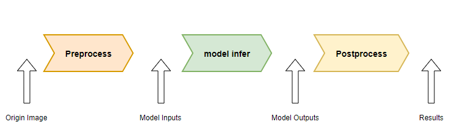
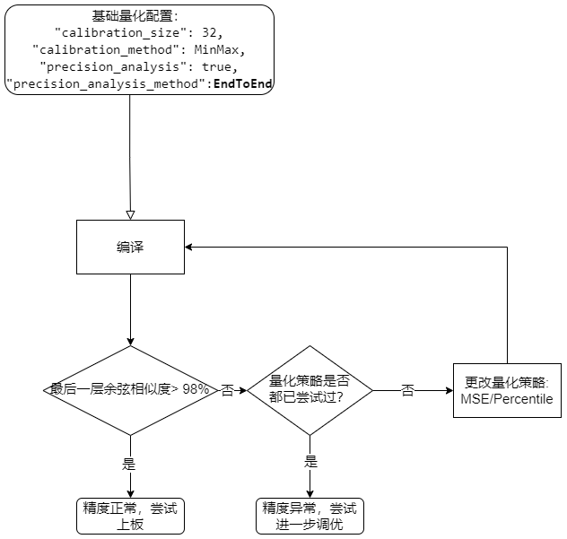
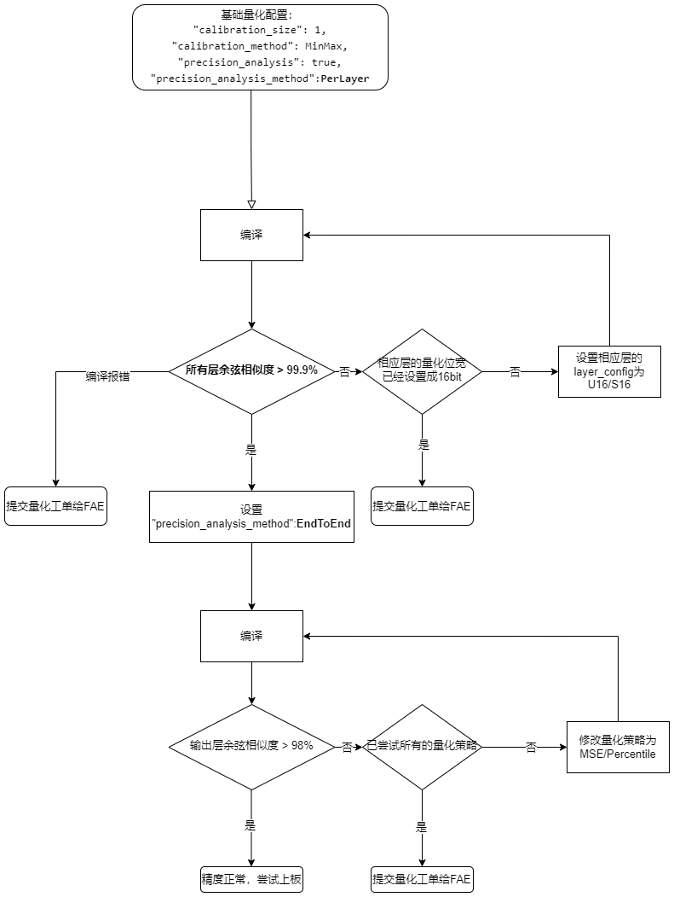

=========================================
Accuracy Tuning Suggestions
=========================================

-----------------------
Basic Troubleshooting
-----------------------

After quantization of floating-point model, it is inevitable that there will be a certain degree of accuracy loss. In order to measure the accuracy loss, a set of quantization accuracy analysis tools is provided in the compilation stage, and the cosine similarity is used to judge whether the accuracy of the model before and after quantization meets the expectation.
Under normal circumstances, when the cosine similarity of the final output layer of the model is > 98%, the accuracy of the quantized model can be considered normal at this time, and the next stage of deployment can be carried out.

.. note::

    It should be noted that the cosine similarity of the quantization precision analysis tool at the compile stage is not equivalent to the accuracy drop on the test data set(Such as ``AP`` ， ``mAP`` )。
    To obtain detailed data set accuracy drops, it is recommended to use the compiled model board to test the model accuracy using the data set.

This chapter will have some basic terms:

- ** Quantization Strategy ** : Refers to the strategy used to calculate the floating point distribution range to obtain quantization parameters, corresponding to the ``calibration_method`` of the ``quant`` field in the configuration.

- ** Quantization bit width ** : refers to the input and output bit width of the operator after quantization, which can be configured through the layer_configs of the quant field.

When encountering accuracy problems, first confirm the following options, and then perform precision tuning according to the following sections:

- mean/std consistent with training: If the quantization is using a data set in the format Image, make sure that calibration_mean and calibration_std in quant are the same as they were during training.
- BGR and RGB format: If the quantization is using data sets in the format Image, make sure that tensor_layout in input_processors is the same as it was during training.
- Ensure the alignment between Python pre and post processing during training and C++ pre and post processing when running on the board. Please refer to Q&A for the alignment method.
- If 'csc_mode' is set to **YUYV422, UYVY422, YUV420SP, YVU420SP**, it is recommended to use **IVE TDP to resize** when testing accuracy on the board. This preprocessing is aligned with Opencv's 'bilinear' interpolation method.
- Quantifying whether the data set is correct:
  - Calibration picture and use scene as much as possible
  - Whether the number of calibration sets is rich enough to cover all categories as far as possible

---------------------------
Common accuracy problems
---------------------------

~~~~~~~~~~~~~~~~~~~~~~~~~~~~~~~~~~~~
How to set the model to all U16?
~~~~~~~~~~~~~~~~~~~~~~~~~~~~~~~~~~~~

.. code-block:: shell

    {
       "layer_configs": [
           {
               "start_tensor_names": ["DEFAULT"], # string of list
               "end_tensor_names": ["DEFAULT"],   # string of list
               "data_type": "U16"
           }
         ]
     }

~~~~~~~~~~~~~~~~~~~~~~~~~~~~~~~~~~~~~~~~~~~~~~~~~~~~~~~~~~~~~~~~~~~~~~~~~~~~~~~~~~~~~~~~~~~~~~~~~~~~~~~~~~~~~~~~~~~~~~~~~~~~~~~~~~~~~~~
Why configure the ``Add`` operator quantization bit width is ``U16`` in the cosine similarity table to see the type or ``U8``?
~~~~~~~~~~~~~~~~~~~~~~~~~~~~~~~~~~~~~~~~~~~~~~~~~~~~~~~~~~~~~~~~~~~~~~~~~~~~~~~~~~~~~~~~~~~~~~~~~~~~~~~~~~~~~~~~~~~~~~~~~~~~~~~~~~~~~~~

- The toolchain will first do a floating point optimization of the input floating point model before quantizing, then the configured operator name/operator type may not appear in the floating point optimized model ``optimized.onnx``. Then can open the output directory ``output/frontend/optimized onnx`` check whether there is the operator.
- The output of the quantized model may be different from the input type, and the operator output type and configuration in the cosine similarity table will often be different, because the input type of the next operator may not be configured to be the same bit width, then the output type of the operator will be set to the input type of the next operator to improve the inference performance. This optimization does not affect accuracy.
- If data transfer class operators such as ``Reshape/Transpose``, setting the type of the class operators will not take effect. Their types are determined by the downstream type of the calculation class operators.

~~~~~~~~~~~~~~~~~~~~~~~~~~~~~~~~~~~~~~~~~~
How to align before and after processing?
~~~~~~~~~~~~~~~~~~~~~~~~~~~~~~~~~~~~~~~~~~

The misalignment of pre and post processing is usually an important reason affecting the accuracy of the upper board. In order to troubleshoot the problem of pre and post processing, we recommend following steps:

- Single data. Save the original input, pre-processed data, model output and post-processed data into bin files using the Python side during training; Here you can visualize the results to ensure that the output is correct
- C++ side test preprocessing: Read the original data saved in the previous step as input, get the C++ pre-processed result, **compared with the pre-processed data saved in the previous step, when the error between the two is within 0.0001 (1e-4), it is considered that the error is in line with the expectation, that is, (a-b) < 0.0001**.
- C++ end test post-processing: read the model output saved in the first step, as the model output, and calculate the post-processing, get the result after C++ end processing, **compared with the post-processing data saved in the first step, when the error is within 0.001 (1e-3), it is considered that the error is in line with the expectation. That is, (a-b) < 0.001**.

~~~~~~~~~~~~~~~~~~
outlier
~~~~~~~~~~~~~~~~~~

The following log appears in the model, indicating that there are a lot of ``outliers`` in the activation value of the model, we recommend using the ``smooth quant`` function to reduce these ``outliers``.

.. code-block:: shell
    
                                            Ratio of outliers in tensor【 level=Log(Max_Pertensor/Max_Perchannel) 】
    ┏━━━━━━━━━━━━━━━━━━━━━━━━━━━━━━━━━━━┳━━━━━━━━━━━━━━━━━━━━━━┳━━━━━━━━━━━━━━━━━━━━┳━━━━━━━━━━━━━━━━━━━━━━━┳━━━━━━━━━━━━━━━━━━━━━━━┳━━━━━━━━━━━━━━━━━━━━━━━┓
    ┃ Op outputs                        ┃ Sparse channel ratio ┃ level>=3 ratio     ┃ level>=4 ratio        ┃ level>=5 ratio        ┃ level>=6 ratio        ┃
    ┡━━━━━━━━━━━━━━━━━━━━━━━━━━━━━━━━━━━╇━━━━━━━━━━━━━━━━━━━━━━╇━━━━━━━━━━━━━━━━━━━━╇━━━━━━━━━━━━━━━━━━━━━━━╇━━━━━━━━━━━━━━━━━━━━━━━╇━━━━━━━━━━━━━━━━━━━━━━━┩
    │ /vision_model/embeddings/patch_e… │ 0.0                  │ 0.6614583134651184 │ 0.3111979067325592    │ 0.00390625            │ 0.0                   │
    ├───────────────────────────────────┼──────────────────────┼────────────────────┼───────────────────────┼───────────────────────┼───────────────────────┤
    │ op_348:onnx.LayerNormalization_0… │ 0.0                  │ 0.921875           │ 0.5169270634651184    │ 0.1080729141831398    │ 0.0403645820915699    │
    ├───────────────────────────────────┼──────────────────────┼────────────────────┼───────────────────────┼───────────────────────┼───────────────────────┤
    │ op_396:onnx.LayerNormalization_0… │ 0.0                  │ 0.4427083432674408 │ 0.2473958283662796    │ 0.12109375            │ 0.0546875             │
    ├───────────────────────────────────┼──────────────────────┼────────────────────┼───────────────────────┼───────────────────────┼───────────────────────┤
    │ op_821:onnx.AxFullyConnected_q_0… │ 0.0                  │ 0.359375           │ 0.1875                │ 0.125                 │ 0.0625                │
    ├───────────────────────────────────┼──────────────────────┼────────────────────┼───────────────────────┼───────────────────────┼───────────────────────┤
    │ op_821:onnx.AxFullyConnected_k_0… │ 0.0                  │ 0.203125           │ 0.078125              │ 0.0625                │ 0.015625              │
    ├───────────────────────────────────┼──────────────────────┼────────────────────┼───────────────────────┼───────────────────────┼───────────────────────┤
    │ op_821:onnx.AxFullyConnected_v_0… │ 0.0                  │ 0.453125           │ 0.203125              │ 0.078125              │ 0.03125               │
    ├───────────────────────────────────┼──────────────────────┼────────────────────┼───────────────────────┼───────────────────────┼───────────────────────┤
    │ op_821:onnx.AxFullyConnected_q_1… │ 0.0                  │ 0.234375           │ 0.125                 │ 0.109375              │ 0.015625              │
    ├───────────────────────────────────┼──────────────────────┼────────────────────┼───────────────────────┼───────────────────────┼───────────────────────┤
    │ op_821:onnx.AxFullyConnected_k_1… │ 0.0                  │ 0.3125             │ 0.140625              │ 0.046875              │ 0.015625              │
    ├───────────────────────────────────┼──────────────────────┼────────────────────┼───────────────────────┼───────────────────────┼───────────────────────┤
    │ op_821:onnx.AxFullyConnected_v_1… │ 0.0                  │ 0.21875            │ 0.03125               │ 0.015625              │ 0.0                   │
    ├───────────────────────────────────┼──────────────────────┼────────────────────┼───────────────────────┼───────────────────────┼───────────────────────┤
    │ op_821:onnx.AxFullyConnected_q_2… │ 0.0                  │ 0.296875           │ 0.203125              │ 0.140625              │ 0.09375               │
    ├───────────────────────────────────┼──────────────────────┼────────────────────┼───────────────────────┼───────────────────────┼───────────────────────┤
    │ op_821:onnx.AxFullyConnected_k_2… │ 0.0                  │ 0.234375           │ 0.109375              │ 0.0625                │ 0.015625              │
    ├───────────────────────────────────┼──────────────────────┼────────────────────┼───────────────────────┼───────────────────────┼───────────────────────┤
    │ op_821:onnx.AxFullyConnected_v_2… │ 0.0                  │ 0.234375           │ 0.125                 │ 0.078125              │ 0.078125              │
    ├───────────────────────────────────┼──────────────────────┼────────────────────┼───────────────────────┼───────────────────────┼───────────────────────┤
    │ op_821:onnx.AxFullyConnected_q_3… │ 0.0                  │ 0.25               │ 0.09375               │ 0.078125              │ 0.03125               │
    ├───────────────────────────────────┼──────────────────────┼────────────────────┼───────────────────────┼───────────────────────┼───────────────────────┤
    │ op_821:onnx.AxFullyConnected_k_3… │ 0.0                  │ 0.1875             │ 0.109375              │ 0.03125               │ 0.015625              │
    ├───────────────────────────────────┼──────────────────────┼────────────────────┼───────────────────────┼───────────────────────┼───────────────────────┤
    │ op_821:onnx.AxFullyConnected_v_3… │ 0.0                  │ 0.296875           │ 0.15625               │ 0.0625                │ 0.0                   │
    ├───────────────────────────────────┼──────────────────────┼────────────────────┼───────────────────────┼───────────────────────┼───────────────────────┤
    │ op_821:onnx.AxFullyConnected_q_4… │ 0.0                  │ 0.234375           │ 0.171875              │ 0.0625                │ 0.046875              │
    ├───────────────────────────────────┼──────────────────────┼────────────────────┼───────────────────────┼───────────────────────┼───────────────────────┤
    │ op_821:onnx.AxFullyConnected_k_4… │ 0.0                  │ 0.359375           │ 0.203125              │ 0.09375               │ 0.046875              │

This feature can be enabled by configuring ``enable_smooth_quant`` in the ``quant`` field.

.. hint::

    The method comes from the paper  `SmoothQuant <https://arxiv.org/abs/2211.10438>`_

-----------------------
Precision tuning steps
-----------------------

~~~~~~~~~~~~~~~~~~~~~~~~~~~~~~~~
Change quantization strategy
~~~~~~~~~~~~~~~~~~~~~~~~~~~~~~~~

To improve the accuracy of the model by changing the quantization strategy, one can try ``MSE`` ``Percentile`` ``MinMax``, corresponding to ``calibration_method`` in the ``quant`` field.

~~~~~~~~~~~~~~~~~~~~~~~~~~~~~~~~~~~
Mixing precision tuning Settings
~~~~~~~~~~~~~~~~~~~~~~~~~~~~~~~~~~~

If the cosine similarity is still low after changing the quantization strategy, the quantization bit width can be adjusted according to the cosine similarity in the ``Quant Precision Table [PerLayer Reference]``, as shown in the following figure.

-----------------------------------
Measuring chemical sheet template
-----------------------------------

Please fill in the details below and submit to FAE/AE.

- Other platform experience
    - Whether it has been deployed on other platforms
    - Corresponding manufacturer, chip model, and toolchain version
    - Quantization scripts or configuration files for other platforms
    - Other platforms execute quantization commands
    - Corresponding data set metrics: floating point accuracy/on-board runtime accuracy/accuracy metrics
- Provide the smallest reproducible case:
    - onnx floating point model
    - Single image test cases for onnx floating-point models, either python or C++
    - config.json configuration file
    - Minimum data set for quantization
    - Compile command of Pulsar2
- If the original model and data set cannot be provided due to data security, it is necessary to provide:
   - Floating-point model with random weights
   - Complete compilation log
   - After precision analysis is enabled ("precision_analysis": true, "precision_analysis_method" : "EndToEnd"), output/quant/debug is packaged.
   - config.json configuration file
   - Minimum data set for quantization
   - Pulsar2 Indicates the compilation command
