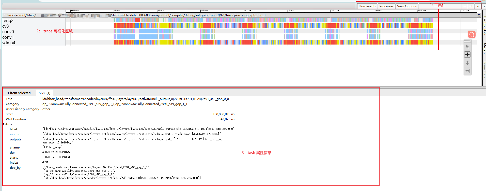
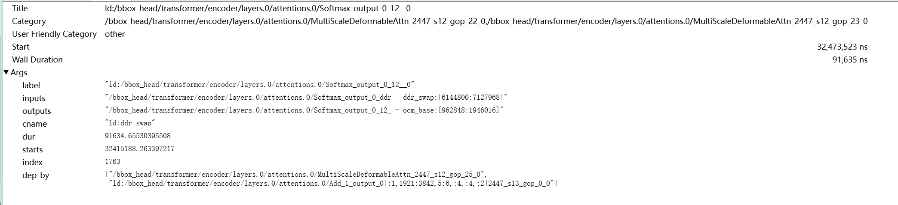
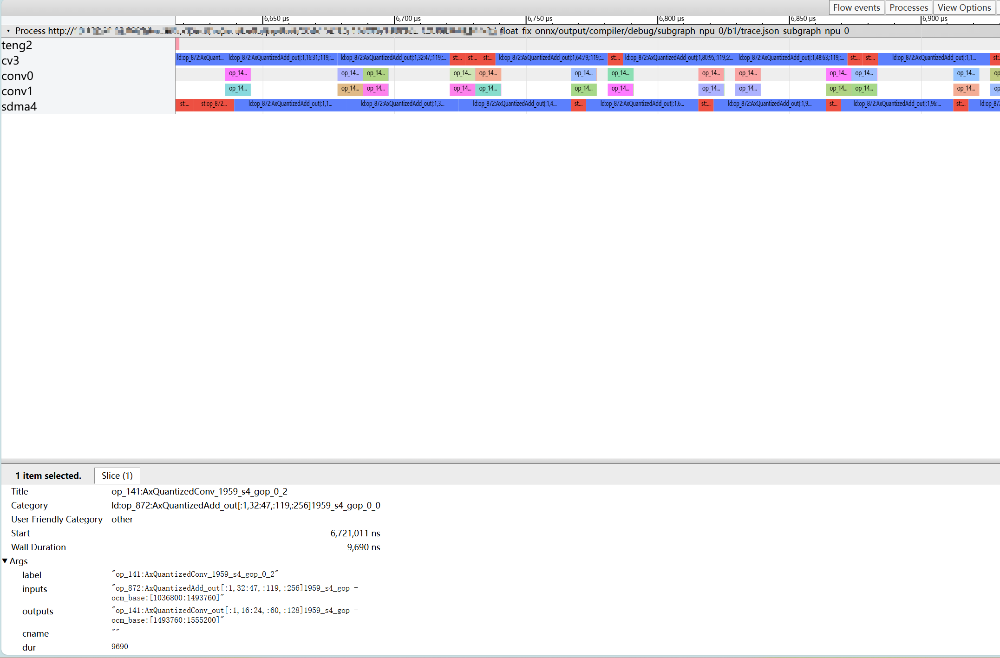
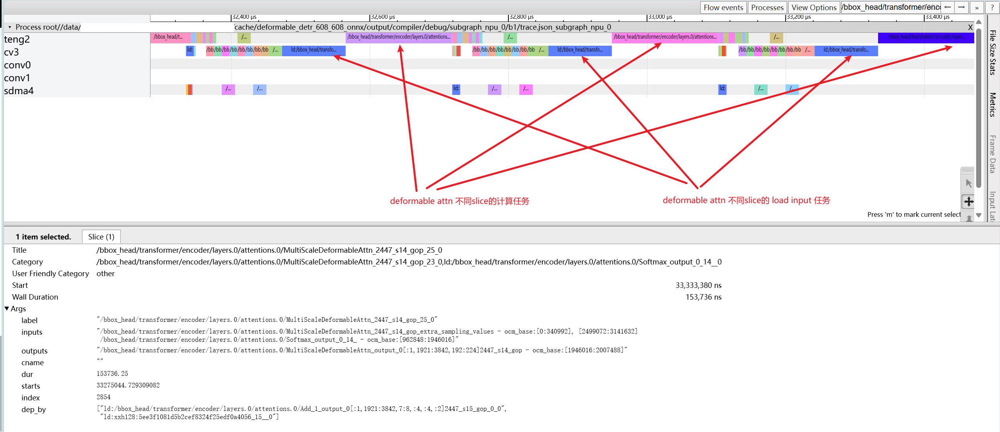

============================
NPU trace tool instructions
============================

NPU trace overview
------------------

- A performance analysis tool that estimates NPU inference performance by evaluating dependencies between tasks (NPU hardware atomic compute tasks) and the cycle model during toolchain compilation.
- Stored as a json file, which contains tasks and their dependency information, and aligns with on-board inference time.
- Works with general offline performance visualization tools such as trace viewer (type ``edge://tracing/`` in Microsoft Edge address bar, or ``chrome://tracing`` in Chrome). Search is supported.

Get trace.json
--------------

- When compiling a model with pulsar2, add the compile option ``--compiler.npu_perf``. The toolchain will save trace information to ``${output_dir}/compiler/debug/subgraph_npu_0/b1/trace.json`` (``subgraph_npu_0`` indicates the first NPU subgraph in the model, and ``b1`` indicates the default batch or batch 1 subgraph).
- Tip: add the compile option ``--debug.dump_frontend_graph``. The toolchain will dump the optimized frontend graph to ``${output_dir}/frontend/optimzied_quant_axmodel.onnx``. In the trace viewer, you can associate tasks with operator names in ``optimzied_quant_axmodel.onnx`` via the task Title, which helps you better understand the relationship between the hardware compute flow and the algorithm graph.

  - ``optimzied_quant_axmodel.onnx`` is in ONNX format and can be opened with Netron. The operators in the graph are the AX operators after frontend conversion.

Trace features
--------------

Trace UI overview
~~~~~~~~~~~~~~~~~

- After opening trace.json in the browser, the UI is shown as above.

  - Toolbar: trace viewer features. You can search tasks by task label.
  - Visualization area: the x-axis is time and the y-axis is NPU IP. It contains the estimated inference time of the current model and the inference tasks on different NPU IPs.
  - Task attributes: click a specific task in the visualization area to display its detailed information.

Details of the visualization area
~~~~~~~~~~~~~~~~~~~~~~~~~~~~~~~~~

- NPU IP overview

  - teng: tensor-engine vector processing unit, mainly used for multi-channel parallel data acceleration.
  - sdma: simple dma, mainly used for data transfer between DDR and OCM.
  - cv: mainly used for data reshape and transfer.
  - conv: CNN compute IP, mainly used for convolution.

- Meaning of task colors

  - Red: task attribute cname **"st:ddr_swap"**
    - sdma/cv: swap OCM data out to the ddr swap region.
    - teng: write the compute result of the current task directly to the ddr swap region.
  - Blue: task attribute cname **"ld:ddr_swap"**
    - load compute data from ddr to OCM.
  - Bright yellow: task attribute cname **"ld:param"**
    - load model weights from ddr to OCM.
  - Green: task attribute cname **"ld:input"**
    - load model input from ddr to OCM.
  - Orange: task attribute cname **"st:output"**
    - write model output to ddr.
  - Others: tasks without specified color/cname, normal compute tasks.

Details of the task attributes area
~~~~~~~~~~~~~~~~~~~~~~~~~~~~~~~~~~~

- **Title**: the task label.

  - As shown above, ``ld:/bbox_head/transformer/encoder/layers.0/attentions.0/Softmax_output_0_12__0`` contains three parts:

    - Task prefix: **"ld:"**

      - Separated from the operator label by **":"**. Common prefixes:

        - ld: the task includes ddr input.
        - st: the task includes ddr output.

      - Normal compute tasks have no prefix.

    - Operator label: **"/bbox_head/transformer/encoder/layers.0/attentions.0/Softmax_output"**

      - The operator label on the optimized frontend graph <**frontend/optimzied_quant_axmodel.onnx**>. You can search it to locate the operator.

    - Task postfix: **"_0_12__0"**

      - Suffixes like **"_[number]"** or **"_s[number]"** (for example **"_123_123"** or **"_s123_gop_123"**).

        - Usually the topo id of the task in the graph + the tiler/slice id.
        - When one operator is split into multiple tasks, the suffix is used as a unique identifier.

- **Category**: the tasks that the current task depends on.
  - "," means multiple dependencies.
- **Start**: task start time.
- **Wall Duration**: task execution time.
- **Args.label**: same as **Title**.
- **Args.inputs**: input tensor names.
  - "," means multiple inputs.
- **Args.outputs**: output tensor names.
- **Args.cname**: task color name. See the color description in **"Details of the visualization area"**.
- **Args.dur**: same as **Wall Duration**.
- **Args.starts**: same as **Start**.
- **Args.dep_by**: task names that depend on the current task.

Common issue analysis
---------------------

Performance degradation caused by too many ddr swaps
~~~~~~~~~~~~~~~~~~~~~~~~~~~~~~~~~~~~~~~~~~~~~~~~~~~~

- As shown above, there are a large number of ld/st ddr swap tasks on cv and sdma, which prevents conv compute tasks from running continuously. This indicates performance degradation due to too many ddr swaps.

Performance bottleneck caused by non-optimal operator implementation
~~~~~~~~~~~~~~~~~~~~~~~~~~~~~~~~~~~~~~~~~~~~~~~~~~~~~~~~~~~~~~~~~~~~

- As shown above, conv is idle while cv and teng are running serially. By checking the operator attributes, you can see that ld and compute of different slices of MultiScaleDeformableAttn are not parallel, which indicates that the slice implementation of this operator needs optimization.
  Alternatively, you can perform graph surgery on the ONNX model and manually split this operator into smaller slices to increase parallelism.
