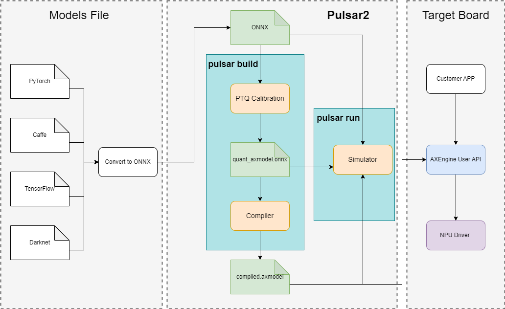

========================================
Pulsar2 Toolchain overview
========================================

----------------------------
Introduction
----------------------------

**Pulsar2** is an ``all-in-one`` new generation neural network compiler **independently developed** by `Axera <https://www.axera-tech.com/>`_, 
That is, **conversion**, **quantification**, **compilation**, and **heterogeneous** are four-in-one to achieve the **fast** and **efficient** deployment requirements of deep learning neural network models. 
In-depth customization and optimization have been carried out for the characteristics of the new generation of `AX6、M7、M5` series chips (AX630C、AX620Q、AX650A、AX650N、M76H、M57H), giving full play to the computing power of the on-chip heterogeneous computing unit (CPU+NPU) to improve the performance of the neural network model. Product deployment efficiency.

**Special Note:**

- Tips in the toolchain documentation
    - **Note**: Note content, further explanation of certain professional terms
    - **Hint**: Hint content, reminding users to confirm relevant information
    - **Attention**: Attention content, reminding users of relevant precautions for tool configuration
    - **Warning**: Warning content, reminding users to pay attention to the correct use of the tool chain. If the customer does not use it according to the Warning prompt content, incorrect results may occur.
- The commands in the tool chain document are compatible with on-board chips, such as ``Pulsar2`` supports ``M76H``
- The **example commands** and **example output** in the tool chain documentation are all based on ``AX650``.
- The computing power configuration of the specific chip is subject to the chip SPEC.

The core function of the ``Pulsar2`` tool chain is to compile the ``.onnx`` model into an ``.axmodel`` model that the chip can parse and run.

**Deployment Process**

.. _soc_introduction:

----------------------------
Introduction to Virtual NPU
----------------------------

.. figure:: ../media/vNPU-ax650.png
    :alt: pipeline
    :align: center

**AX650 and M76H NPU** are mainly composed of **3** Conv convolution calculation cores and 3 sets of vector Vector calculation cores. These Conv and Vector computing cores are allocated in a 1:1 ratio and divided into **3 groups of vNPU**.

- At runtime, you can set the working mode of the NPU through the **AXEngine API** and flexibly group the vNPUs. It can be set to three symmetrical vNPU modes of 1 + 1 + 1, or a large vNPU mode of 2 + 1. It can also be set to 3 large computing power single vNPU mode.

- When converting the model, you can flexibly specify the number of vNPUs required for model inference according to your needs (see the ``--npu_mode parameter`` of ``pulsar2 build`` for details). When the model is deployed and loaded on the chip platform, AXEngine can allocate the model to run on the vNPU with corresponding computing power according to the currently set NPU working mode.

.. figure:: ../media/vNPU-ax620e.png
    :alt: pipeline
    :align: center

**AX630C、AX620Q** adopt a dual-core NPU design and are divided into two working conditions to allocate different computing power to users depending on whether AI-ISP is enabled.

- When converting the model, you need to explicitly configure the NPU working mode of the user model according to the actual working conditions of AI-ISP in the business (for details, please see the ``--npu_mode parameter`` of ``pulsar2 build``).
- The NPU modules in AX630C、AX620Q all use **Neutron 4.0** NPU engine. The subsequent chapters use ``AX620E`` to simplify the target hardware platform specification.

----------------------------------------------------
Guide to the content of subsequent chapters
----------------------------------------------------

* **Section3**: This chapter introduces the preparation and installation of the hardware and software environment for model conversion and deployment using the NPU tool chain. How to install ``Docker`` and start the container in different system environments
* **Section4**: This chapter introduces the basic application process of the NPU tool chain on the Axera AX650 (including AX650A, AX650N, M76H) chip platform
* **Section5**: This chapter introduces the basic application process of the NPU tool chain on the Axera AX620E (including AX620Q, AX630C) chip platform
* **Section6**: This chapter is an advanced description of model conversion, that is, a detailed description of how to use the ``Pulsar2 Docker`` tool chain to convert the ``onnx`` model to the ``axmodel`` model
* **Section7**: This chapter is an advanced description of model simulation, that is, a detailed description of how to use the ``axmodel`` model to simulate and run on the ``x86`` platform and measure the difference between the inference results and the ``onnx`` inference results (internally called ``bisection``)
* **Section8**: This chapter is an advanced description of running the model on the board, that is, a detailed description of how to run ``axmodel`` on the board to get the inference results of the model on the Axera SOC hardware
* **Section9**: This chapter describes in detail the configuration file used in the model conversion and compilation process
* **Section10**: The model exported by the Caffe AI training platform is not in the ``onnx`` format supported by the NPU tool chain. A tool is required to convert the Caffe model into an ``onnx`` model. This chapter introduces how to use this model conversion tool.
* **Section11**: This chapter is an instruction for using the speed and accuracy test tool on the model board
* **Section12**: This chapter is a statement of functional safety compliance of the NPU tool chain
* **Appendix**: The document appendix includes a list of supported operators and accuracy tuning suggestions

.. note::

    The so-called ``bisection`` is to compare the error between the inference results of different versions (file types) of the same model before and after the toolchain is compiled.