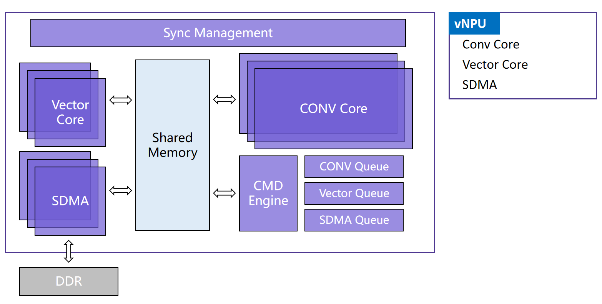

========================================
Pulsar2 Toolchain overview
========================================

----------------------------
Introduction
----------------------------

**Pulsar2** is an ``all-in-one`` new generation neural network compiler **independently developed** by `AXera <https://www.axera-tech.com/>`_, 
That is, **conversion**, **quantification**, **compilation**, and **heterogeneous** are four-in-one to achieve the **fast** and **efficient** deployment requirements of deep learning neural network models. 
In-depth customization and optimization have been carried out for the characteristics of the new generation of `AX6 and M7` series chips (AX630C, AX620AV200, AX620Q, AX650A, AX650N, M76H), giving full play to the computing power of the on-chip heterogeneous computing unit (CPU+NPU) to improve the performance of the neural network model. Product deployment efficiency.

**Special Note:**

- The commands in the tool chain document are compatible with on-board chips, such as ``Pulsar2`` supports ``M76H``
- The **example commands** and **example output** in the tool chain documentation are all based on ``AX650``.
- The computing power configuration of the specific chip is subject to the chip SPEC.

The core function of the ``Pulsar2`` tool chain is to compile the ``.onnx`` model into an ``.axmodel`` model that the chip can parse and run.

**Deployment Process**

.. figure:: ../media/deploy-pipeline.png
    :alt: pipeline
    :align: center

.. _soc_introduction_en:

----------------------------
Introduction to Virtual NPU
----------------------------

**AX650 and M76H NPU** are mainly composed of **3** Conv convolution calculation cores and 3 sets of vector Vector calculation cores. These Conv and Vector computing cores are allocated in a 1:1 ratio and divided into **3 groups of vNPU**.

- At runtime, you can set the working mode of the NPU through the **AXEngine API** and flexibly group the vNPUs. It can be set to three symmetrical vNPU modes of 1 + 1 + 1, or a large vNPU mode of 2 + 1. It can also be set to 3 large computing power single vNPU mode.

- When converting the model, you can flexibly specify the number of vNPUs required for model inference according to your needs (see the ``--npu_mode parameter`` of ``pulsar2 build`` for details). When the model is deployed and loaded on the chip platform, AXEngine can allocate the model to run on the vNPU with corresponding computing power according to the currently set NPU working mode.

.. figure:: ../media/vNPU-ax620e.png
    :alt: pipeline
    :align: center

**AX630C, AX620AV200, and AX620Q** adopt a dual-core NPU design and are divided into two working conditions to allocate different computing power to users depending on whether AI-ISP is enabled.

- When converting the model, you need to explicitly configure the NPU working mode of the user model according to the actual working conditions of AI-ISP in the business (for details, please see the ``--npu_mode parameter`` of ``pulsar2 build``).
- The NPU modules in AX630C, AX620AV200, and AX620Q all use **Neutron 4.0** NPU engine. The subsequent chapters use ``AX620E`` to simplify the target hardware platform specification.