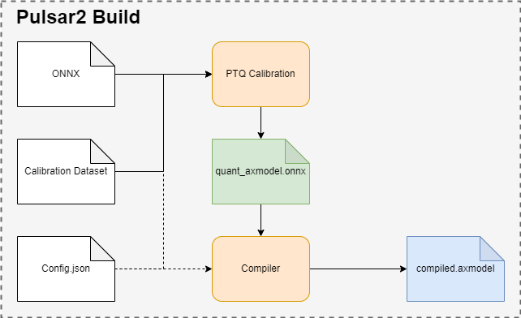

===================================
Advanced Guide to Model Conversion
===================================

-----------------------
Overview
-----------------------

``pulsar2 build`` is used for model **graph optimization**, **quantification**, **compilation** and other operations. Its operation diagram is as follows:

* ``pulsar2 build`` uses the input model (``model.onnx``), PTQ calibration data (``calibration.tar``) and configuration file (``config.json``) to generate the output model (``axmodel``).
* The command line parameters of ``pulsar2 build`` will overwrite certain corresponding parts in the configuration file, and cause ``pulsar2 build`` to output the overwritten configuration file. For a detailed introduction to the configuration file, see :ref:`《Configuration file details》 <config_details_en>`.

------------------------------------------
Detailed explanation of model compilation
------------------------------------------

This section introduces the complete use of the ``pulsar2 build`` command.

``pulsar2 build -h`` can display detailed command line parameters: 

.. code-block:: shell
  :name: pulsar_build_help
  :linenos:

    usage: main.py build [-h] [--config] [--input] [--output_dir] [--output_name]
                         [--work_dir] [--model_type] [--target_hardware]
                         [--npu_mode] [--input_shapes]
                         [--onnx_opt.disable_onnx_optimization]
                         [--onnx_opt.enable_onnxsim] [--onnx_opt.model_check]
                         [--onnx_opt.disable_transformation_check]
                         [--quant.calibration_method] [--quant.precision_analysis]
                         [--quant.precision_analysis_method]
                         [--quant.precision_analysis_mode]
                         [--quant.highest_mix_precision]
                         [--quant.conv_bias_data_type]
                         [--quant.refine_weight_threshold]
                         [--quant.enable_smooth_quant]
                         [--quant.transformer_opt_level]
                         [--quant.input_sample_dir] [--quant.ln_scale_data_type]
                         [--compiler.static_batch_sizes [...]]
                         [--compiler.max_dynamic_batch_size]
                         [--compiler.disable_ir_fix] [--compiler.check]
                         [--compiler.debug] [--compiler.input_sample_dir]
    
    optional arguments:
      -h, --help            show this help message and exit
      --config              config file path, supported formats: json / yaml /
                            toml / prototxt. type: string. required: false.
                            default:.
      --input               input model file path. type: string. required: true.
      --output_dir          axmodel output directory. type: string. required:
                            true.
      --output_name         rename output axmodel. type: string. required: false.
                            default: compiled.axmodel.
      --work_dir            temporary data output directory. type: string.
                            required: false. default: same with ${output_dir}.
      --model_type          input model type. type: enum. required: false.
                            default: ONNX. option: ONNX, QuantAxModel, QuantONNX.
      --target_hardware     target hardware. type: enum. required: false. default:
                            AX650. option: AX650, AX620E, M76H.
      --npu_mode            npu mode. while ${target_hardware} is AX650, npu mode
                            can be NPU1 / NPU2 / NPU3. while ${target_hardware} is
                            AX620E, npu mode can be NPU1 / NPU2. type: enum.
                            required: false. default: NPU1.
      --input_shapes        modify model input shape, this feature will take
                            effect before the `input_processors` configuration.
                            format: input1:1x3x224x224;input2:1x1x112x112. type:
                            string. required: false. default: .
      --onnx_opt.disable_onnx_optimization 
                            disable onnx optimization. type: bool. required:
                            false. default: false.
      --onnx_opt.enable_onnxsim 
                            enable onnx simplify by
                            https://github.com/daquexian/onnx-simplifier. type:
                            bool. required: false. default: false.
      --onnx_opt.model_check 
                            enable model check. type: bool. required: false.
                            default: false.
      --onnx_opt.disable_transformation_check 
                            disable transformation check. type: bool. required:
                            false. default: false.
      --quant.calibration_method 
                            quantize calibration method. type: enum. required:
                            false. default: MinMax. option: MinMax, Percentile,
                            MSE.
      --quant.precision_analysis 
                            enable quantization precision analysis. type: bool.
                            required: false. default: false.
      --quant.precision_analysis_method 
                            precision analysis method. type: enum. required:
                            false. default: PerLayer. option: PerLayer, EndToEnd.
      --quant.precision_analysis_mode 
                            precision analysis mode. type: enum. required: false.
                            default: Reference. option: Reference, NPUBackend.
      --quant.highest_mix_precision 
                            enable highest mix precision quantization. type: bool.
                            required: false. default: false.
      --quant.conv_bias_data_type 
                            conv bias data type. type: enum. required: false.
                            default: S32. option: S32, FP32.
      --quant.refine_weight_threshold 
                            refine weight threshold, should be a legal float
                            number, like 1e-6. -1 means disable this feature.
                            type: float. required: false. default: 1e-6.
                            limitation: 0 or less than 0.0001.
      --quant.enable_smooth_quant 
                            enalbe smooth quant strategy for conv 1x1. type: bool.
                            required: false. default: false.
      --quant.transformer_opt_level 
                            tranformer opt level. type: int. required: false.
                            default: 0. limitation: 0~2.
      --quant.input_sample_dir 
                            input sample data dir for precision analysis. type:
                            string. required: false. default: .
      --quant.ln_scale_data_type 
                            LayerNormalization scale data type. type: enum.
                            required: false. default: FP32. option: FP32, S32,
                            U32.
      --compiler.static_batch_sizes [ ...]
                            static batch sizes. type: int array. required: false.
                            default: [].
      --compiler.max_dynamic_batch_size 
                            max dynamic batch. type: int, required: false.
                            default: 0.
      --compiler.disable_ir_fix 
                            disable ir fix, only work in multi-batch compilation.
                            type: bool. required: false. default: false.
      --compiler.check      compiler check level, 0: no check; 1: simulate compile
                            result; 2: simulate and check compile result (for
                            debug). type: int. required: false. default: 0.
      --compiler.debug      compiler debug level. type: int. required: false.
                            default: 0.
      --compiler.input_sample_dir 
                            input sample data dir for compiler check. type:
                            string. required: false. default: .

.. hint::

  - Users can write configuration files in the format of ``json/yaml/toml/prototxt`` according to parameter specifications, and point to the configuration file through the command line parameter ``--config``
  - Some compilation parameters support command line input and have higher priority than configuration files. Use pulsar2 build -h to view the supported command line compilation parameters. For example, the command line parameter ``--quant.calibration_method`` is equivalent to the ``calibration_method`` field of the ``QuantConfig`` structure is configured

~~~~~~~~~~~~~~~~~~~~~~~~~~~~~~~~~~~
Detailed explanation of parameters
~~~~~~~~~~~~~~~~~~~~~~~~~~~~~~~~~~~

.. data:: pulsar2 build's parameter explanation

    --config

        - type of data: string
        - required or not:  yes
        - description：configuration file path, supports ``json/yaml/toml/prototxt`` format, see :ref:`《Configuration File Detailed Description》 <config_details_en>` for the structure

    --work_dir

        - type of data: string
        - required or not:  no
        - default value: same as output_dir
        - description： intermediate result output directory

    --input

        - type of data: string
        - required or not:  yes
        - description： model enter path

    --output_dir

        - type of data: string
        - required or not:  yes
        - description： compilation result output directory, the compiled model is named compiled.axmodel

    --model_type

        - type of data: enum
        - required or not:  no
        - default value: ONNX
        - description： input model type, supports enumeration: ``ONNX``, ``QuantAxModel``, ``QuantONNX``

    --target_hardware

        - type of data: enum
        - required or not:  no
        - default value: AX650
        - description： the target soc platform type for model compilation, supports ``AX650``, ``AX620E``, ``M76H``

    --npu_mode

        - type of data: enum
        - required or not:  no
        - default value: NPU1
        - description： model compilation mode

            * When the soc platform is ``AX650``, enumeration is supported: ``NPU1``, ``NPU2``, ``NPU3``
            * When the SOC platform is ``AX620E``, enumeration is supported: ``NPU1``, ``NPU2``

      .. warning:: npu_mode refers to the number of NPU cores used, not the vNPU number, please don't be confused.

    --input_shapes

        - type of data: string
        - required or not:  no
        - default value: empty
        - description： during the model compilation process, modify the input size of the model in the format: ``input1:1x3x224x224;input2:1x1x112x112``.

    --onnx_opt

        - disable_onnx_optimization

            - type of data: bool
            - required or not:  no
            - default value: false
            - description： whether to enable the floating-point ONNX model graph optimization module.

        - enable_onnxsim

            - type of data: bool
            - required or not:  no
            - default value: false
            - description： whether to use the `onnxsim` tool to simplify floating point ONNX, https://github.com/daquexian/onnx-simplifier.

        - model_check

            - type of data: bool
            - required or not:  no
            - default value: false
            - description： whether to enable the bisection function of the floating-point ONNX model graph after optimization with the original ONNX model.

        - disable_transformation_check

            - type of data: bool
            - required or not:  no
            - default value: false
            - description： whether to disable the subgraph bisection function after each subgraph transformation during floating-point ONNX model graph optimization.

    --quant

        A member variable named quant in BuiildConfig

        - calibration_method

            - type of data: enum
            - required or not:  no
            - default value: MinMax
            - description： Quantization algorithm, supported enumerations ``MinMax``, ``Percentile``, ``MSE``, the structure can be found in :ref:`《Configuration File Detailed Description》 <config_details_en>`

        - precision_analysis

            - type of data: bool
            - required or not:  no
            - default value: false
            - description： whether to analyze the quantification accuracy of Quant AXModel layer by layer

        - precision_analysis_method

            - type of data: enum
            - required or not:  no
            - default value: PerLayer
            - description： precision analysis method, optional PerLayer / EndToEnd. PerLayer means that each layer uses the layer input corresponding to the floating point model, and calculates the similarity between the output of each layer and the output of the floating point model. EndToEnd means that the first layer adopts floating point model input, then simulates the complete model, and calculates the similarity between the final output result and the floating point model output.

        - precision_analysis_mode

            - type of data: enum
            - required or not:  no
            - default value: Reference
            - description： Implementation of layer-by-layer simulation, optional Reference / NPUBackend. Reference can run all models supported by the compiler (supports models including CPU and NPU subgraphs), but the calculation results will have a small error compared to the final board results (basically the difference is within plus or minus 1, and there is no systematic error ). NPUBackend can run models containing only NPU subgraphs, but the calculation results are bit-aligned with the upper-board results.

        - highest_mix_precision

            - type of data: bool
            - required or not:  no
            - default value: false
            - description： whether to enable the highest precision quantization mode.

        - conv_bias_data_type

            - type of data: enum
            - required or not:  no
            - default value: S32
            - description： the data type saved by the Bias attribute of the Conv operator during quantization, optional S32/FP32.

        - refine_weight_threshold

            - type of data: float
            - required or not:  no
            - default value: 1e-6
            - description： adjusts the weight quantization threshold to the specified value.

        - enable_smooth_quant

            - type of data: bool
            - required or not:  no
            - default value: false
            - description： enable smooth quant quantization strategy to improve quantization accuracy.

        - transformer_opt_level

            - type of data: int
            - required or not:  no
            - default value: 0
            - description： Quantization mode configuration of Transformer network.

        - input_sample_dir

            - type of data: string
            - required or not:  no
            - default value: 空
            - description： Configures the input data directory used for quantification accuracy analysis. If not specified, data from the quantification calibration set is used.

            .. note::

                Note that the format of the input data in ``--quant.input_sample_dir`` should be the same as the original model.

    --compiler

        A member variable named compiler in BuildConfig

        - static_batch_sizes

            - type of data: list of int
            - required or not:  no
            - default value: 0
            - description： The compiler compiles according to the batch combination provided by the user. Based on this set of batch models, it can support efficient inference of any batch_size input at runtime. For details, please refer to: :ref:`《Static multi-batch mode》<multi_batch_static_compile_en>`.

        - max_dynamic_batch_size

            - type of data: int
            - required or not:  no
            - default value: 0
            - description： The compiler automatically derives a batch model combination that the NPU can run efficiently and is no larger than max_dynamic_batch_size. Based on this set of batch models, efficient inference of any batch_size input can be supported at runtime. For details, please refer to: :ref:`《Dynamic multi-batch mode》<multi_batch_dynamic_compile_en>`.

        - disable_ir_fix

            - type of data: bool
            - required or not:  no
            - default value: false
            - description： whether to disable the compiler's default Reshape operator attribute modification behavior during multi-batch compilation.

        - check

            - type of data: int
            - required or not:  no
            - default value: 0
            - description： whether to check the correctness of the compilation results through simulation, 0 means no checking; 1 means checking whether the compilation results can run correctly; 2 means checking whether the output data of the model is correct.

        - input_sample_dir

            - type of data: string
            - required or not:  no
            - default value: empty
            - description： configures the input data directory used for compiler checks. If not specified, quantization calibration data will be used in preference.

            .. note::

                Note that the input data in ``--compiler.input_sample_dir`` should be in the same format as the compiled model (including preprocessing).

-------------------------------------------------
Detailed explanation of multi-core compilation
-------------------------------------------------

Users can flexibly configure the **NPU compilation mode** by modifying the ``--npu_mode`` option in ``pulsar2 build`` to make full use of computing power.

~~~~~~~~~~~~~~~~~~~~~~~~~~~~~~
NPU single core mode
~~~~~~~~~~~~~~~~~~~~~~~~~~~~~~

The default configuration of ``--npu_mode`` is ``NPU1``, which is ``1 NPU core`` mode. The previous :ref:`《Model Compilation》 <model_compile_en>` chapter used the default configuration of ``NPU1`` for explanation.

~~~~~~~~~~~~~~~~~~~~~~~~~~~~~~
NPU dual core mode
~~~~~~~~~~~~~~~~~~~~~~~~~~~~~~

``--npu_mode`` configuration is modified to ``NPU2``, that is, ``2 NPU core`` mode. Taking the example of converting the ``mobilenetv2`` model, modify the configuration file as follows:

.. code-block::

    {
      "model_type": "ONNX",
      "npu_mode": "NPU2",   # Just change it here, default is NPU1
      "quant": {
        "input_configs": [
          {
            "tensor_name": "input",
            "calibration_dataset": "./dataset/imagenet-32-images.tar",
            "calibration_size": 32,
            "calibration_mean": [103.939, 116.779, 123.68],
            "calibration_std": [58.0, 58.0, 58.0]
          }
        ],
        "calibration_method": "MinMax",
        "precision_analysis": false
      },
      "input_processors": [
        {
          "tensor_name": "input",
          "tensor_format": "BGR",
          "src_format": "BGR",
          "src_dtype": "U8",
          "src_layout": "NHWC",
          "csc_mode": "NoCSC"
        }
      ],
      "compiler": {
        "check": 0
      }
    }

The compilation command of ``pulsar2 build`` as follows:

.. code-block::

    root@xxx:/data# pulsar2 build --input model/mobilenetv2-sim.onnx --output_dir output --config config/mobilenet_v2_build_config.json

.. _multi_batch_compile_en:

-------------------------------------------------
Detailed explanation of multi-batch compilation
-------------------------------------------------

``pulsar2 build`` supports users to configure the batch_size of the model, which is divided into two modes: static multi-batch and dynamic multi-batch compilation. These two modes are mutually exclusive. This chapter uses ``AX650`` as an example.

.. _multi_batch_static_compile_en:

~~~~~~~~~~~~~~~~~~~~~~~~~~~~~~
Static multi-batch mode
~~~~~~~~~~~~~~~~~~~~~~~~~~~~~~

The compiler compiles according to the batch combination provided by the user, and supports two ways of configuring the command line parameter ``--compiler.static_batch_sizes`` and modifying ``compiler.static_batch_sizes`` in the configuration file.

* After setting up static multi-batch compilation, when viewing ``compiled.axmodel`` through ``onnx inspect -m -n -t``, the batch dimension of the input and output shape will become the maximum batch specified by the user.

     * **Weight data will be reused as much as possible between batches**, so the model size is smaller than the sum of the model sizes of each batch compiled separately.

.. hint::

    Taking the mobilenetv2 model as an example, the original model input ``input`` shape is ``[1, 224, 224, 3]``,
    After static multi-batch compilation with ``static_batch_sizes`` equal to [1, 2, 4], the shape will become ``[4, 224, 224, 3]``.

.. _multi_batch_dynamic_compile_en:

~~~~~~~~~~~~~~~~~~~~~~~~~~~~~~
Dynamic multi-batch mode
~~~~~~~~~~~~~~~~~~~~~~~~~~~~~~

The compiler automatically derives a batch model combination that the NPU can run efficiently and is no larger than ``max_dynamic_batch_size``. Based on this set of batch models, efficient inference of any batch_size input can be supported at runtime. Supports two ways of configuring the command line parameter ``--compiler.max_dynamic_batch_size`` and modifying ``compiler.max_dynamic_batch_size`` in the configuration file.

* The compiler will start from batch 1 and compile in 2-fold increments. It will stop when the batch is larger than the set ``max_dynamic_batch_size`` or the theoretical reasoning efficiency of the current batch is lower than that of the previous batch.

     * Batch theoretical reasoning efficiency: theoretical reasoning takes / batch_size.

     * **Weight data will be reused as much as possible between batches**, so the model size is smaller than the sum of the model sizes of each batch compiled separately.

* After setting up dynamic multi-batch compilation, when viewing ``compiled.axmodel`` through ``onnx inspect -m -n -t``, the batch dimension of the input and output shape will become ``max_dynamic_batch_size``.

.. hint::

     Taking the mobilenetv2 model as an example, the original model input ``input`` shape is ``[1, 224, 224, 3]``,
     After doing a dynamic multi-batch compilation with max_dynamic_batch_size equal to 4, the shape will become ``[4, 224, 224, 3]``.

* When running, it will find the appropriate batch combination and perform multiple inferences based on the dynamic batch size set by the caller during inference.

.. hint::

     When the theoretical inference efficiency of a model increases as the number of batches increases and there is only one NPU subgraph after compilation and ``max_dynamic_batch_size`` is set to 4, the compiled ``compiled.axmodel`` will contain [1, 2 , 4] model of three batches.

     When reasoning or simulating:

     * If the dynamic batch value is set to 3, the ``axengine inference framework`` and ``pulsar2 run emulator`` will internally perform batch 2 + batch 1 twice for NPU inference or simulation.
     * If the dynamic batch value is set to 9, the ``axengine inference framework`` and ``pulsar2 run emulator`` will perform batch 4 + batch 4 + batch 1 three times of NPU inference or simulation internally.
  
During dynamic multi-batch compilation, the following logs will show the compiled batch combinations:

.. code-block:: bash

    ...
    2023-07-09 20:06:02.690 | INFO     | yamain.command.build:compile_npu_subgraph:985 - QuantAxModel macs: 280,262,480
    2023-07-09 20:06:06.786 | WARNING  | yamain.command.build:compile_npu_subgraph:1035 - graph [subgraph_npu_0] batchs [1, 2]
    2023-07-09 20:06:06.795 | INFO     | yamain.command.build:compile_ptq_model:924 - fuse 1 subgraph(s)

~~~~~~~~~~~~~~~~~~~~~~~~~~~~~~~~~~~~~~~~~~~~~~~~~~~~~~~~~~~~~~~~~~~~
Multi-batch compilation of models containing the Reshape operator
~~~~~~~~~~~~~~~~~~~~~~~~~~~~~~~~~~~~~~~~~~~~~~~~~~~~~~~~~~~~~~~~~~~~

If the model contains the ``Reshape`` operator, ``pulsar2`` may not be able to correctly infer the output shape of the ``Reshape`` operator when performing multi-batch compilation.

At this time, the user can modify the ``shape`` input data of the ``Reshape`` operator through the :ref:`《Constant Data Modification》<Const_patch_en>` function, so that ``pulsar2`` can be correct during the multi-batch compilation process. Derive the output shape.

For example, there is a ``Reshape`` operator with a shape of ``[2, 1, 64]``. Assuming that the first dimension is batch, through the constant data modification function. the constant tensor corresponding to the shape is modified to ``[2, -1, 64]`` or ``[2, 0, 64]`` to support multi-batch compilation.

In addition, if the user does not explicitly configure the operator attribute modification, then ``pulsar2`` will modify the 0th dimension of the ``Reshape`` operator**shape to -1, and try to perform multi-batch compilation**.

.. hint::

     pulsar2 supports configuring ``0`` or ``-1`` in the shape of ``Reshape``. ``0`` represents the same value as the corresponding dimension of the input tensor; ``-1`` represents the unknown dimension size calculated based on the input tensor.

.. _perlayer_precision_debug_en:

------------------------------------
Detailed explanation layer by layer
------------------------------------

``pulsar2 build`` provides a set of layer-by-layer accuracy comparison tools between floating-point models and quantized models. There are two ways to configure it, just choose one:

* Configure ``--quant.precision_analysis 1`` on the command line to enable the precision comparison function; the following is an example:

.. code-block:: bash

     root@xxx:/data/quick_start_example# pulsar2 build --input model/mobilenetv2-sim.onnx --output_dir output --config config/config_mobilenet_v2_onnx.json --quant.precision_analysis 1

* The compilation command remains unchanged, and ``"precision_analysis": false`` is modified to ``"precision_analysis": true`` in the configuration file:

.. code-block:: bash

    {
      "model_type": "ONNX",
      "npu_mode": "NPU1",
      "quant": {
        "input_configs": [
          {
            "tensor_name": "input",
            "calibration_dataset": "./dataset/imagenet-32-images.tar",
            "calibration_size": 32,
            "calibration_mean": [103.939, 116.779, 123.68],
            "calibration_std": [58.0, 58.0, 58.0]
          }
        ],
        "calibration_method": "MinMax",
        "precision_analysis": true  # change here is true, default is false
      },
      "input_processors": [
        {
          "tensor_name": "input",
          "tensor_format": "BGR",
          "src_format": "BGR",
          "src_dtype": "U8",
          "src_layout": "NHWC",
          "csc_mode": "NoCSC"
        }
      ],
      "compiler": {
        "check": 0
      }
    }

After re-executing the compilation process, you can get the following output information with ``Quant Precision Table``, including **node name, type, output name, data type, output shape, cosine similarity**, etc.:

.. code-block:: bash

    root@xxx:/data# pulsar2 build --input model/mobilenetv2-sim.onnx --output_dir output --config config/mobilenet_v2_build_config.json
    ...
    Building native ━━━━━━━━━━━━━━━━━━━━━━━━━━━━━━━━━━━━━━━━ 100% 0:00:00
                                          Quant Precision Table 【PerLayer Reference】
    ┏━━━━━━━━━━━━━━━━━━━━━━┳━━━━━━━━━━━━━━━━━━━━━━━━━━━┳━━━━━━━━━━━━━━━┳━━━━━━━━━━━┳━━━━━━━━━━━━━━━━━━━┳━━━━━━━━━━━━━━━━━━━━┓
    ┃ Operator             ┃ Type                      ┃ Output Tensor ┃ Data Type ┃ Shape             ┃ Cosin Distance     ┃
    ┡━━━━━━━━━━━━━━━━━━━━━━╇━━━━━━━━━━━━━━━━━━━━━━━━━━━╇━━━━━━━━━━━━━━━╇━━━━━━━━━━━╇━━━━━━━━━━━━━━━━━━━╇━━━━━━━━━━━━━━━━━━━━┩
    │ Conv_0               │ AxQuantizedConv           │ 474           │ FP32      │ (1, 32, 112, 112) │ 0.999932050704956  │
    ├──────────────────────┼───────────────────────────┼───────────────┼───────────┼───────────────────┼────────────────────┤
    │ Conv_2               │ AxQuantizedConv           │ 477           │ FP32      │ (1, 32, 112, 112) │ 0.9994480609893799 │
    ├──────────────────────┼───────────────────────────┼───────────────┼───────────┼───────────────────┼────────────────────┤
    │ Conv_4               │ AxQuantizedConv           │ 480           │ FP32      │ (1, 16, 112, 112) │ 0.9990373849868774 │
    ├──────────────────────┼───────────────────────────┼───────────────┼───────────┼───────────────────┼────────────────────┤
    │ Conv_5               │ AxQuantizedConv           │ 483           │ FP32      │ (1, 96, 112, 112) │ 0.9993898272514343 │
    ├──────────────────────┼───────────────────────────┼───────────────┼───────────┼───────────────────┼────────────────────┤
    │ Conv_7               │ AxQuantizedConv           │ 486           │ FP32      │ (1, 96, 56, 56)   │ 0.9991888999938965 │
    ├──────────────────────┼───────────────────────────┼───────────────┼───────────┼───────────────────┼────────────────────┤
    │ Conv_9               │ AxQuantizedConv           │ 489           │ FP32      │ (1, 24, 56, 56)   │ 0.9991229772567749 │
    ├──────────────────────┼───────────────────────────┼───────────────┼───────────┼───────────────────┼────────────────────┤
    │ Conv_10              │ AxQuantizedConv           │ 492           │ FP32      │ (1, 144, 56, 56)  │ 0.999823272228241  │
    ├──────────────────────┼───────────────────────────┼───────────────┼───────────┼───────────────────┼────────────────────┤
    │ Conv_12              │ AxQuantizedConv           │ 495           │ FP32      │ (1, 144, 56, 56)  │ 0.9995720386505127 │
    ├──────────────────────┼───────────────────────────┼───────────────┼───────────┼───────────────────┼────────────────────┤
    │ Conv_14              │ AxQuantizedConv           │ 498           │ FP32      │ (1, 24, 56, 56)   │ 0.9993237853050232 │
    ├──────────────────────┼───────────────────────────┼───────────────┼───────────┼───────────────────┼────────────────────┤
    │ Add_15               │ AxQuantizedAdd            │ 339           │ FP32      │ (1, 24, 56, 56)   │ 0.9992991089820862 │
    ├──────────────────────┼───────────────────────────┼───────────────┼───────────┼───────────────────┼────────────────────┤
    │ Conv_16              │ AxQuantizedConv           │ 501           │ FP32      │ (1, 144, 56, 56)  │ 0.9996923208236694 │
    ├──────────────────────┼───────────────────────────┼───────────────┼───────────┼───────────────────┼────────────────────┤
    │ Conv_18              │ AxQuantizedConv           │ 504           │ FP32      │ (1, 144, 28, 28)  │ 0.9997930526733398 │
    ├──────────────────────┼───────────────────────────┼───────────────┼───────────┼───────────────────┼────────────────────┤
    │ Conv_20              │ AxQuantizedConv           │ 507           │ FP32      │ (1, 32, 28, 28)   │ 0.9997037053108215 │
    ├──────────────────────┼───────────────────────────┼───────────────┼───────────┼───────────────────┼────────────────────┤
    │ Conv_21              │ AxQuantizedConv           │ 510           │ FP32      │ (1, 192, 28, 28)  │ 0.9998888373374939 │
    ├──────────────────────┼───────────────────────────┼───────────────┼───────────┼───────────────────┼────────────────────┤
    │ Conv_23              │ AxQuantizedConv           │ 513           │ FP32      │ (1, 192, 28, 28)  │ 0.9993594884872437 │
    ├──────────────────────┼───────────────────────────┼───────────────┼───────────┼───────────────────┼────────────────────┤
    │ Conv_25              │ AxQuantizedConv           │ 516           │ FP32      │ (1, 32, 28, 28)   │ 0.9995540976524353 │
    ├──────────────────────┼───────────────────────────┼───────────────┼───────────┼───────────────────┼────────────────────┤
    │ Add_26               │ AxQuantizedAdd            │ 356           │ FP32      │ (1, 32, 28, 28)   │ 0.999687135219574  │
    ├──────────────────────┼───────────────────────────┼───────────────┼───────────┼───────────────────┼────────────────────┤
    │ Conv_27              │ AxQuantizedConv           │ 519           │ FP32      │ (1, 192, 28, 28)  │ 0.9998943209648132 │
    ├──────────────────────┼───────────────────────────┼───────────────┼───────────┼───────────────────┼────────────────────┤
    │ Conv_29              │ AxQuantizedConv           │ 522           │ FP32      │ (1, 192, 28, 28)  │ 0.9997372031211853 │
    ├──────────────────────┼───────────────────────────┼───────────────┼───────────┼───────────────────┼────────────────────┤
    │ Conv_31              │ AxQuantizedConv           │ 525           │ FP32      │ (1, 32, 28, 28)   │ 0.9995033144950867 │
    ├──────────────────────┼───────────────────────────┼───────────────┼───────────┼───────────────────┼────────────────────┤
    │ Add_32               │ AxQuantizedAdd            │ 365           │ FP32      │ (1, 32, 28, 28)   │ 0.9996601343154907 │
    ├──────────────────────┼───────────────────────────┼───────────────┼───────────┼───────────────────┼────────────────────┤
    │ Conv_33              │ AxQuantizedConv           │ 528           │ FP32      │ (1, 192, 28, 28)  │ 0.9998391270637512 │
    ├──────────────────────┼───────────────────────────┼───────────────┼───────────┼───────────────────┼────────────────────┤
    │ Conv_35              │ AxQuantizedConv           │ 531           │ FP32      │ (1, 192, 14, 14)  │ 0.999911367893219  │
    ├──────────────────────┼───────────────────────────┼───────────────┼───────────┼───────────────────┼────────────────────┤
    │ Conv_37              │ AxQuantizedConv           │ 534           │ FP32      │ (1, 64, 14, 14)   │ 0.9996770024299622 │
    ├──────────────────────┼───────────────────────────┼───────────────┼───────────┼───────────────────┼────────────────────┤
    │ Conv_38              │ AxQuantizedConv           │ 537           │ FP32      │ (1, 384, 14, 14)  │ 0.9999406337738037 │
    ├──────────────────────┼───────────────────────────┼───────────────┼───────────┼───────────────────┼────────────────────┤
    │ Conv_40              │ AxQuantizedConv           │ 540           │ FP32      │ (1, 384, 14, 14)  │ 0.9997537136077881 │
    ├──────────────────────┼───────────────────────────┼───────────────┼───────────┼───────────────────┼────────────────────┤
    │ Conv_42              │ AxQuantizedConv           │ 543           │ FP32      │ (1, 64, 14, 14)   │ 0.9997888207435608 │
    ├──────────────────────┼───────────────────────────┼───────────────┼───────────┼───────────────────┼────────────────────┤
    │ Add_43               │ AxQuantizedAdd            │ 382           │ FP32      │ (1, 64, 14, 14)   │ 0.9997644424438477 │
    ├──────────────────────┼───────────────────────────┼───────────────┼───────────┼───────────────────┼────────────────────┤
    │ Conv_44              │ AxQuantizedConv           │ 546           │ FP32      │ (1, 384, 14, 14)  │ 0.9999357461929321 │
    ├──────────────────────┼───────────────────────────┼───────────────┼───────────┼───────────────────┼────────────────────┤
    │ Conv_46              │ AxQuantizedConv           │ 549           │ FP32      │ (1, 384, 14, 14)  │ 0.9998541474342346 │
    ├──────────────────────┼───────────────────────────┼───────────────┼───────────┼───────────────────┼────────────────────┤
    │ Conv_48              │ AxQuantizedConv           │ 552           │ FP32      │ (1, 64, 14, 14)   │ 0.9997283816337585 │
    ├──────────────────────┼───────────────────────────┼───────────────┼───────────┼───────────────────┼────────────────────┤
    │ Add_49               │ AxQuantizedAdd            │ 391           │ FP32      │ (1, 64, 14, 14)   │ 0.9997260570526123 │
    ├──────────────────────┼───────────────────────────┼───────────────┼───────────┼───────────────────┼────────────────────┤
    │ Conv_50              │ AxQuantizedConv           │ 555           │ FP32      │ (1, 384, 14, 14)  │ 0.9998891353607178 │
    ├──────────────────────┼───────────────────────────┼───────────────┼───────────┼───────────────────┼────────────────────┤
    │ Conv_52              │ AxQuantizedConv           │ 558           │ FP32      │ (1, 384, 14, 14)  │ 0.9995425939559937 │
    ├──────────────────────┼───────────────────────────┼───────────────┼───────────┼───────────────────┼────────────────────┤
    │ Conv_54              │ AxQuantizedConv           │ 561           │ FP32      │ (1, 64, 14, 14)   │ 0.9989281892776489 │
    ├──────────────────────┼───────────────────────────┼───────────────┼───────────┼───────────────────┼────────────────────┤
    │ Add_55               │ AxQuantizedAdd            │ 400           │ FP32      │ (1, 64, 14, 14)   │ 0.9995357394218445 │
    ├──────────────────────┼───────────────────────────┼───────────────┼───────────┼───────────────────┼────────────────────┤
    │ Conv_56              │ AxQuantizedConv           │ 564           │ FP32      │ (1, 384, 14, 14)  │ 0.9998661875724792 │
    ├──────────────────────┼───────────────────────────┼───────────────┼───────────┼───────────────────┼────────────────────┤
    │ Conv_58              │ AxQuantizedConv           │ 567           │ FP32      │ (1, 384, 14, 14)  │ 0.9998401999473572 │
    ├──────────────────────┼───────────────────────────┼───────────────┼───────────┼───────────────────┼────────────────────┤
    │ Conv_60              │ AxQuantizedConv           │ 570           │ FP32      │ (1, 96, 14, 14)   │ 0.9996302723884583 │
    ├──────────────────────┼───────────────────────────┼───────────────┼───────────┼───────────────────┼────────────────────┤
    │ Conv_61              │ AxQuantizedConv           │ 573           │ FP32      │ (1, 576, 14, 14)  │ 0.9998155832290649 │
    ├──────────────────────┼───────────────────────────┼───────────────┼───────────┼───────────────────┼────────────────────┤
    │ Conv_63              │ AxQuantizedConv           │ 576           │ FP32      │ (1, 576, 14, 14)  │ 0.9993364810943604 │
    ├──────────────────────┼───────────────────────────┼───────────────┼───────────┼───────────────────┼────────────────────┤
    │ Conv_65              │ AxQuantizedConv           │ 579           │ FP32      │ (1, 96, 14, 14)   │ 0.9981837868690491 │
    ├──────────────────────┼───────────────────────────┼───────────────┼───────────┼───────────────────┼────────────────────┤
    │ Add_66               │ AxQuantizedAdd            │ 417           │ FP32      │ (1, 96, 14, 14)   │ 0.9994098544120789 │
    ├──────────────────────┼───────────────────────────┼───────────────┼───────────┼───────────────────┼────────────────────┤
    │ Conv_67              │ AxQuantizedConv           │ 582           │ FP32      │ (1, 576, 14, 14)  │ 0.998947262763977  │
    ├──────────────────────┼───────────────────────────┼───────────────┼───────────┼───────────────────┼────────────────────┤
    │ Conv_69              │ AxQuantizedConv           │ 585           │ FP32      │ (1, 576, 14, 14)  │ 0.9985659718513489 │
    ├──────────────────────┼───────────────────────────┼───────────────┼───────────┼───────────────────┼────────────────────┤
    │ Conv_71              │ AxQuantizedConv           │ 588           │ FP32      │ (1, 96, 14, 14)   │ 0.9961519241333008 │
    ├──────────────────────┼───────────────────────────┼───────────────┼───────────┼───────────────────┼────────────────────┤
    │ Add_72               │ AxQuantizedAdd            │ 426           │ FP32      │ (1, 96, 14, 14)   │ 0.998038113117218  │
    ├──────────────────────┼───────────────────────────┼───────────────┼───────────┼───────────────────┼────────────────────┤
    │ Conv_73              │ AxQuantizedConv           │ 591           │ FP32      │ (1, 576, 14, 14)  │ 0.9991413950920105 │
    ├──────────────────────┼───────────────────────────┼───────────────┼───────────┼───────────────────┼────────────────────┤
    │ Conv_75              │ AxQuantizedConv           │ 594           │ FP32      │ (1, 576, 7, 7)    │ 0.9995304346084595 │
    ├──────────────────────┼───────────────────────────┼───────────────┼───────────┼───────────────────┼────────────────────┤
    │ Conv_77              │ AxQuantizedConv           │ 597           │ FP32      │ (1, 160, 7, 7)    │ 0.9926491379737854 │
    ├──────────────────────┼───────────────────────────┼───────────────┼───────────┼───────────────────┼────────────────────┤
    │ Conv_78              │ AxQuantizedConv           │ 600           │ FP32      │ (1, 960, 7, 7)    │ 0.9965869784355164 │
    ├──────────────────────┼───────────────────────────┼───────────────┼───────────┼───────────────────┼────────────────────┤
    │ Conv_80              │ AxQuantizedConv           │ 603           │ FP32      │ (1, 960, 7, 7)    │ 0.9980652332305908 │
    ├──────────────────────┼───────────────────────────┼───────────────┼───────────┼───────────────────┼────────────────────┤
    │ Conv_82              │ AxQuantizedConv           │ 606           │ FP32      │ (1, 160, 7, 7)    │ 0.9920080900192261 │
    ├──────────────────────┼───────────────────────────┼───────────────┼───────────┼───────────────────┼────────────────────┤
    │ Add_83               │ AxQuantizedAdd            │ 443           │ FP32      │ (1, 160, 7, 7)    │ 0.9830436706542969 │
    ├──────────────────────┼───────────────────────────┼───────────────┼───────────┼───────────────────┼────────────────────┤
    │ Conv_84              │ AxQuantizedConv           │ 609           │ FP32      │ (1, 960, 7, 7)    │ 0.99485182762146   │
    ├──────────────────────┼───────────────────────────┼───────────────┼───────────┼───────────────────┼────────────────────┤
    │ Conv_86              │ AxQuantizedConv           │ 612           │ FP32      │ (1, 960, 7, 7)    │ 0.9986639022827148 │
    ├──────────────────────┼───────────────────────────┼───────────────┼───────────┼───────────────────┼────────────────────┤
    │ Conv_88              │ AxQuantizedConv           │ 615           │ FP32      │ (1, 160, 7, 7)    │ 0.9871683716773987 │
    ├──────────────────────┼───────────────────────────┼───────────────┼───────────┼───────────────────┼────────────────────┤
    │ Add_89               │ AxQuantizedAdd            │ 452           │ FP32      │ (1, 160, 7, 7)    │ 0.9710026383399963 │
    ├──────────────────────┼───────────────────────────┼───────────────┼───────────┼───────────────────┼────────────────────┤
    │ Conv_90              │ AxQuantizedConv           │ 618           │ FP32      │ (1, 960, 7, 7)    │ 0.9886921048164368 │
    ├──────────────────────┼───────────────────────────┼───────────────┼───────────┼───────────────────┼────────────────────┤
    │ Conv_92              │ AxQuantizedConv           │ 621           │ FP32      │ (1, 960, 7, 7)    │ 0.9995152950286865 │
    ├──────────────────────┼───────────────────────────┼───────────────┼───────────┼───────────────────┼────────────────────┤
    │ Conv_94              │ AxQuantizedConv           │ 624           │ FP32      │ (1, 320, 7, 7)    │ 0.9987302422523499 │
    ├──────────────────────┼───────────────────────────┼───────────────┼───────────┼───────────────────┼────────────────────┤
    │ Conv_95              │ AxQuantizedConv           │ 627           │ FP32      │ (1, 1280, 7, 7)   │ 0.9998956918716431 │
    ├──────────────────────┼───────────────────────────┼───────────────┼───────────┼───────────────────┼────────────────────┤
    │ GlobalAveragePool_97 │ AxQuantizedAvgPool        │ 464           │ FP32      │ (1, 1280, 1, 1)   │ 0.9999791979789734 │
    ├──────────────────────┼───────────────────────────┼───────────────┼───────────┼───────────────────┼────────────────────┤
    │ Reshape_103          │ AxReshape                 │ 472           │ FP32      │ (1, 1280)         │ 0.9999794960021973 │
    ├──────────────────────┼───────────────────────────┼───────────────┼───────────┼───────────────────┼────────────────────┤
    │ Gemm_104             │ AxQuantizedFullyConnected │ output        │ FP32      │ (1, 1000)         │ 0.99989914894104   │
    └──────────────────────┴───────────────────────────┴───────────────┴───────────┴───────────────────┴────────────────────┘
    ...

.. hint::

    For more details, please refer to :ref:`《Quantitative Precision Analysis Parameter Description》 <quant_precision_analysis_config_define_en>`.

.. note::

    If ``"precision_analysis": false`` is in the configuration file and the compilation command contains ``--quant.precision_analysis 1``, the precision comparison function will still be enabled.

-------------------------------------------------
Detailed explanation of loading custom data sets
-------------------------------------------------

``pulsar2 build`` supports loading user-defined data sets for quantification, and supports ``.npy`` and ``.bin`` file formats with suffixes.

~~~~~~~~~~~~~~~~
Prepare dataset
~~~~~~~~~~~~~~~~

It is recommended that when processing images, try to be the same as the preprocessing during inference, and try to avoid using data enhancement during training. Some reference steps are as follows:

     - read pictures
     - Align image ``rbg channel`` sequentially to model input
     - Zoom pictures
     - Normalized

The above steps are for reference only and can be adjusted and deleted according to the actual situation. If some models do not require normalization of images, the normalization step can be omitted for such models.

After processing the images, package the corresponding format files into compressed files.

.. note::

     The ``npy`` suffix file refers to a file saved in the ``Numpy`` array format. When using this file format, you need to ensure that the data type and shape of the array when saving are consistent with the corresponding model input, and the suffix name is ``. npy``.

     The ``bin`` suffix file refers to a file saved in binary format. When using this file format, the data should be saved in binary with the suffix ``.bin``.

~~~~~~~~~~~~~~~~~~~~~~~~~~~~~~~
Configuration and compilation
~~~~~~~~~~~~~~~~~~~~~~~~~~~~~~~

Modify the ``quant.input_configs.calibration_format`` field to ``Numpy`` or ``Binary``. A complete example is as follows:

.. code-block:: shell

    {
      "model_type": "ONNX",
      "npu_mode": "NPU1",
      "quant": {
        "input_configs": [
          {
            "tensor_name": "input",
            "calibration_dataset": "./dataset/npy_dataset.tar",
            "calibration_size": 10,
            "calibration_mean": [103.939, 116.779, 123.68],
            "calibration_std": [58.0, 58.0, 58.0],
            "calibration_format": "Numpy", # change to Numpy or Binary, the default is Image
          }
        ],
        "calibration_method": "MinMax",
      },
      "input_processors": [
        {
          "tensor_name": "input",
          "tensor_format": "BGR",
          "src_format": "BGR",
          "src_dtype": "U8",
          "src_layout": "NHWC",
          "csc_mode": "NoCSC"
        }
      ],
      "compiler": {
        "check": 0
      }
    }

After compilation is executed, the ``Data Format`` field in ``Quant Config Table`` is changed to ``Numpy``. The result is as follows:

.. code-block:: bash

    root@aa:/data/quick_start_example# pulsar2 build --input model/mobilenetv2-sim.onnx --output_dir npy_output/ --config config/npy_config_mobilenet_v2_onnx.json
    ...
                                                                            Quant Config Table
    ┏━━━━━━━┳━━━━━━━━━━━━━━━━━━┳━━━━━━━━━━━━━━━━━━━┳━━━━━━━━━━━━━┳━━━━━━━━━━━━━━━┳━━━━━━━━━━━━━━━━━━━━━━━━━━━━━━━━━━━━━━━━━━━━━━━━━━━━━━━━━━━━━━┳━━━━━━━━━━━━━━━━━━━━┓
    ┃ Input ┃ Shape            ┃ Dataset Directory ┃ Data Format ┃ Tensor Format ┃ Mean                                                         ┃ Std                ┃
    ┡━━━━━━━╇━━━━━━━━━━━━━━━━━━╇━━━━━━━━━━━━━━━━━━━╇━━━━━━━━━━━━━╇━━━━━━━━━━━━━━━╇━━━━━━━━━━━━━━━━━━━━━━━━━━━━━━━━━━━━━━━━━━━━━━━━━━━━━━━━━━━━━━╇━━━━━━━━━━━━━━━━━━━━┩
    │ input │ [1, 3, 224, 224] │ input             │ Numpy       │ BGR           │ [103.93900299072266, 116.77899932861328, 123.68000030517578] │ [58.0, 58.0, 58.0] │
    └───────┴──────────────────┴───────────────────┴─────────────┴───────────────┴──────────────────────────────────────────────────────────────┴────────────────────┘
    ...

.. _mix_precision_quantization_en:

-----------------------------------------------------
Detailed explanation of mixed precision quantization
-----------------------------------------------------

``pulsar2 build`` supports mixed precision quantization, and you can set the quantization precision for a specified ``operator`` or ``a type of operator`` or ``a certain subgraph``.

~~~~~~~~~~~~~~~~
Configuration
~~~~~~~~~~~~~~~~

Modify the ``quant.layer_configs`` field. The currently supported enumerations for quantization precision are: ``U8``, ``U16``.
The following is an example configuration:

.. code-block:: shell

    {
      "model_type": "ONNX",
      "npu_mode": "NPU1",
      "quant": {
        "input_configs": [
          {
            "tensor_name": "DEFAULT",
            "calibration_dataset": "./dataset/imagenet-32-images.tar",
            "calibration_size": 32,
            "calibration_mean": [103.939, 116.779, 123.68],
            "calibration_std": [58.0, 58.0, 58.0]
          }
        ],
        "layer_configs": [ 
            {
              "op_type": "Add", # specifies the quantization precision of operators of type Add
              "data_type": "U16"
            },
            {
              "layer_name": "conv6_4", # specify the quantization precision of the conv6_4 operator
              "data_type": "U16"
            },
            {
              # specify the quantization accuracy of the operators contained in the subgraph between conv2_1_linear_bn and relu2_2_dwise
              "start_tensor_names": "conv2_1_linear_bn",
              "end_tensor_names": "relu2_2_dwise",
              "data_type": "U16"
            }
        ],
        "calibration_method": "MinMax",
        "precision_analysis": false
      },
      "input_processors": [
        {
          "tensor_name": "input",
          "tensor_format": "BGR",
          "src_format": "BGR",
          "src_dtype": "U8",
          "src_layout": "NHWC",
          "csc_mode": "NoCSC"
        }
      ],
      "compiler": {
        "check": 0
      }
    }

.. note::

    If there are two quantization precision configurations ``layer_name`` and ``op_type`` for an operator, then the ``layer_name`` configuration has higher priority.

~~~~~~~~~~~~~~~~~~~~~~~~
Compilation and results
~~~~~~~~~~~~~~~~~~~~~~~~

There will be a ``Layer Config Table`` when compiling to display the current layer_configs configuration.

.. code-block:: bash

    root@aa:/data/quick_start_example# pulsar2 build --input model/mobilenetv2-sim.onnx --output_dir output --config config/mobilenet_v2_mix_precision_config.json
    ...
                                                                            Quant Config Table
    ┏━━━━━━━┳━━━━━━━━━━━━━━━━━━┳━━━━━━━━━━━━━━━━━━━┳━━━━━━━━━━━━━┳━━━━━━━━━━━━━━━┳━━━━━━━━━━━━━━━━━━━━━━━━━━━━━━━━━━━━━━━━━━━━━━━━━━━━━━━━━━━━━━┳━━━━━━━━━━━━━━━━━━━━┓
    ┃ Input ┃ Shape            ┃ Dataset Directory ┃ Data Format ┃ Tensor Format ┃ Mean                                                         ┃ Std                ┃
    ┡━━━━━━━╇━━━━━━━━━━━━━━━━━━╇━━━━━━━━━━━━━━━━━━━╇━━━━━━━━━━━━━╇━━━━━━━━━━━━━━━╇━━━━━━━━━━━━━━━━━━━━━━━━━━━━━━━━━━━━━━━━━━━━━━━━━━━━━━━━━━━━━━╇━━━━━━━━━━━━━━━━━━━━┩
    │ input │ [1, 3, 224, 224] │ input             │ Image       │ BGR           │ [103.93900299072266, 116.77899932861328, 123.68000030517578] │ [58.0, 58.0, 58.0] │
    └───────┴──────────────────┴───────────────────┴─────────────┴───────────────┴──────────────────────────────────────────────────────────────┴────────────────────┘
            Layer Config Table
    ┏━━━━━━━━━━━━━━━━━━━━━━┳━━━━━━━━━━━┓
    ┃ Op Type / Layer name ┃ Precision ┃
    ┡━━━━━━━━━━━━━━━━━━━━━━╇━━━━━━━━━━━┩
    │ Add                  │ U16       │
    ├──────────────────────┼───────────┤
    │ conv6_4              │ U16       │
    └──────────────────────┴───────────┘
    ...

After compilation, a ``quant_axmodel.json`` file will be generated in the ``output/quant`` directory, which records the quantization configuration information of each operator. A part of it is excerpted below for use as an example.

.. code-block:: shell

    "Add_26": {
      "507": {
        "bit_width": 16,
        "policy": {
          "PER_TENSOR": true,
          "PER_CHANNEL": false,
          "LINEAR": true,
          "EXPONENTIAL": false,
          "SYMMETRICAL": false,
          "ASYMMETRICAL": true,
          "POWER_OF_2": false
        },
        "state": "ACTIVATED",
        "quant_min": 0,
        "quant_max": 65535,
        "hash": 762206185,
        "dominator": 762206185
      },
      "516": {
        "bit_width": 16,
        "policy": {
          "PER_TENSOR": true,
          "PER_CHANNEL": false,
          "LINEAR": true,
          "EXPONENTIAL": false,
          "SYMMETRICAL": false,
          "ASYMMETRICAL": true,
          "POWER_OF_2": false
        },
        "state": "OVERLAPPED",
        "quant_min": 0,
        "quant_max": 65535,
        "hash": 3471866632,
        "dominator": 4099361028
      }
    }

.. _change_input_size_en:

------------------------------------
Enter size modification
------------------------------------

By modifying the configuration file, the dimensions of each input can be modified during the model conversion process.

Next, based on ``mobilenetv2``, modify the model input to ``384*384``

1. Command line mode, add parameters: ``--input_shapes data:1x3x384x384``

2. Configuration file method, add parameters to the root node:

.. code-block:: shell

    {
       ...
       "input_shapes": "data:1x3x384x384",
       ...
    }

During the model conversion process, the following log will appear, indicating that the model input size has been modified successfully:

.. code-block:: shell

    INFO[0006] 2023-08-24 20:04:59.530 | WARNING  | yamain.command.load_model:optimize_onnx_model:640 - change input shape to {'data': (1, 3, 384, 384)}

.. note::

    Model input size modification occurs before input preprocessing.

    Multiple sets of inputs are separated by half-width semicolons. For details, please refer to the parameter detailed explanation section.

.. _op_attr_patch_en:

------------------------------------
Operator attribute modification
------------------------------------

By modifying the configuration file, the properties of a specific operator can be modified during the model conversion process.

Next, based on ``mobilenetv2``, modify the ``ceil_mode`` of the ``AveragePool`` operator named ``pool6`` to ``1``, and add the following content to the configuration file:

.. code-block:: shell

    "op_processors": [
      {
        "op_name": "pool6",
        "attrs": {
          "ceil_mode": 1
        }
      }
    ],

When using pulsar2 build to convert the model, the following log will appear, indicating that the operator attributes have been modified successfully:

.. code-block:: shell

    2023-05-07 18:47:34.274 | INFO     | yamain.command.load_model:op_attr_patch:488 - set op [pool6] attr [ceil_mode] to 1

.. _const_patch_en:

------------------------------------
Constant data modification
------------------------------------

By modifying the configuration file, specific constant data can be modified during the model conversion process.

Assume that a model contains a ``Reshape`` operator named ``reshape_0``. The ``shape`` input of this operator is a constant data named ``reshape_0_shape``, and the original data is `` [1, 96, 48]``.

Add the following content to the configuration file to modify the constant data to ``[-1, 96, 48]``.

.. code-block:: shell

    "const_processors": [
      {
        "name": "reshape_0_shape",
        "data": [-1, 96, 48]
      }
    ],

When using pulsar2 build to convert the model, the following log will appear, indicating that the constant data has been modified successfully:

.. code-block:: shell

    2023-05-07 18:15:41.464 | WARNING  | yamain.command.load_model:const_patch:512 - update data of const tensor [reshape_0_shape], (-1,, 96, 48), S64

.. _transformer_optimize_en:

----------------------------------------
Transformer model configuration details
----------------------------------------

For the Transformer model, you can set different levels of optimization through ``quant.transformer_opt_level``.

Currently, three levels of settings ``0``, ``1``, and ``2`` are supported.

The following is an example of the ``Swin-T`` model, the configuration is as follows

.. code-block:: shell

    "quant": {
        "input_configs": [
          {
            "tensor_name": "DEFAULT",
            "calibration_dataset": "dataset.tar",
            "calibration_format": "Image",
            "calibration_size": 32,
            "calibration_mean": [123.68, 116.779, 103.939],
            "calibration_std": [58.62, 57.34, 57.6]
          }
        ],
        "calibration_method": "MSE",
        "transformer_opt_level": 2 # set the transformer optimization level to 2
    },

When using ``pulsar2 build`` to convert the model, the following log will appear, indicating that the configuration modification is successful:

.. code-block:: shell

    INFO[0176] Transformer optimize level: 2

The following table shows the accuracy and performance of ``Swin-T`` under different optimization levels. The floating point accuracy (acc1) of this model is ``81.2%``

================== ============== ==============
Optimization level Accuracy(acc1) time consuming
================== ============== ==============
1                  80.488%        7.266ms
2                  80.446%        7.114ms
================== ============== ==============

.. note::

     The current version recommends setting level ``1``. In actual measurements, level ``2`` has a smaller performance improvement than level ``1``, while the accuracy of level ``1`` is slightly better.

.. note::

     The models that have been verified so far include ``Swin`` series, ``SwinV2`` series, ``Deit`` series, and ``Vit`` series.

------------------------------------
Quantized ONNX model import
------------------------------------

In order to support customers' self-quantized models (including 4-bit QAT quantization), ``AX650`` and ``M76H`` support quantized models in Quantized ONNX format as input. The model format uses ONNX QDQ format.

The following takes the resnet50 and yolov5s 4w8f models as examples to demonstrate how to compile models in Quantized ONNX format.

First, please download the model we have converted, :download:`Click to download resnet50 <../examples/resnet50_qdq_4w8f.onnx>`, :download:`Click to download yolov5s <../examples/yolov5s_qdq_4w8f.onnx>`

Then use the following configuration file for resnet50:

.. code-block:: json

    {
      "model_type": "QuantONNX",
      "npu_mode": "NPU1",
      "quant": {
        "input_configs": [
          {
            "tensor_name": "DEFAULT",
            "calibration_dataset": "s3://npu-ci/data/dataset_v04.zip",
            "calibration_size": 64,
            "calibration_mean": [103.939, 116.779, 123.68],
            "calibration_std": [1.0, 1.0, 1.0]
          }
        ],
        "calibration_method": "MinMax"
      },
      "input_processors": [
        {
          "tensor_name": "data",
          "src_format": "BGR",
          "src_dtype": "U8",
          "src_layout": "NHWC"
        }
      ],
      "compiler": {
        "check": 0
      }
    }

Finally, use the pulsar2 build command to compile, and you will get the ``compiled.axmodel`` file.

.. code-block:: shell

    pulsar2 build --target_hardware AX650 --input path/to/model.onnx  --config path/to/config.json --output_dir output

.. hint::
   
    Specify the input model type as Quantized ONNX through ``"model_type": "QuantONNX"`` in the configuration file.

    Using a similar method, we can compile the yolov5s Quantized ONNX format model. We only need to replace it with the following configuration file for compilation:

.. code-block:: json

    {
      "model_type": "QuantONNX",
      "npu_mode": "NPU1",
      "quant": {
        "input_configs": [
          {
            "tensor_name": "DEFAULT",
            "calibration_dataset": "s3://npu-ci/data/coco_calib_image.tar",
            "calibration_size": 32,
            "calibration_mean": [0, 0, 0],
            "calibration_std": [255.0, 255.0, 255.0]
          }
        ],
        "layer_configs": [
          {
            "op_type": "Silu",
            "data_type": "U16"
          }
        ],
        "calibration_method": "MSE"
      },
      "input_processors": [
        {
          "tensor_name": "DEFAULT",
          "tensor_format": "RGB",
          "tensor_layout": "NCHW",
          "src_format": "BGR",
          "src_layout": "NHWC",
          "src_dtype": "U8"
        }
      ],
      "compiler": {
        "check": 0
      }
    }
