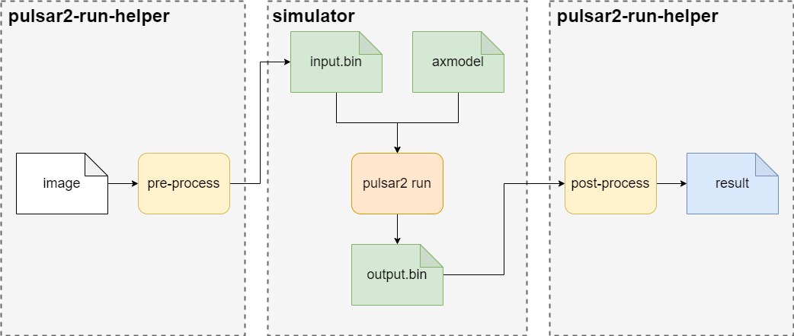

=========================================
Advanced Guide to Simulation Running
=========================================

-------------------------------
Overview
-------------------------------

``pulsar2 run`` is used to perform **x86 simulation inference calculation** on the ``axmodel`` model on the ``x86`` platform, and obtain the compiled model running results in advance.

.. _pulsar_run_en:

---------------------------------------------------
Detailed explanation of simulation operation
---------------------------------------------------

~~~~~~~~~~~~~~~~~~~~~
pulsar2 run 
~~~~~~~~~~~~~~~~~~~~~

This section introduces the complete use of the ``pulsar2 run`` command.

``pulsar2 run -h`` can display detailed command line parameters:

.. code-block:: python
    :name: input_conf_items
    :linenos:

    usage: main.py run [-h] [--config] [--model] [--input_dir] [--output_dir]
                       [--list] [--random_input] [--batch_size]
                       [--enable_perlayer_output] [--mode] [--target_hardware]
    
    optional arguments:
      -h, --help            show this help message and exit
      --config              config file path, supported formats: json / yaml /
                            toml / prototxt. type: string. required: false.
                            default:.
      --model               run model path, support ONNX, QuantAxModel and
                            CompiledAxmodel. type: string. required: true.
      --input_dir           model input data in this directory. type: string.
                            required: true. default:.
      --output_dir          model output data directory. type: string. required:
                            true. default:.
      --list                list file path. type: string. required: true.
                            default:.
      --random_input        random input data. type: bool. required: false.
                            default: false.
      --batch_size          batch size to be used in dynamic inference mode, only
                            work for CompiledAxModel. type: int. required: false.
                            defalult: 0.
      --enable_perlayer_output 
                            enable dump perlayer output. type: bool. required:
                            false. default: false.
      --mode                run mode, only work for QuantAxModel. type: enum.
                            required: false. default: Reference. option:
                            Reference, NPUBackend.
      --target_hardware     target hardware, only work for QuantAxModel. type:
                            enum. required: false. default: AX650. option: AX650,
                            AX620E, M76H.

.. data:: Detailed explanation of parameters
  
    --model

        - type of data: string
        - required or not: yes
        - description: model path for inference simulation. The model supports ``ONNX``, ``QuantAXModel`` or ``AXModel`` format.

    --input_dir

        - type of data: string
        - required or not: yes
        - description: the directory where the model simulation input data files are located.

    --output_dir
    
        - type of data: string
        - required or not: yes
        - description: the directory where the model simulation output data files are located.

    --list
    
        - type of data: string
        - required or not: no
        - default value: ""
        - description: if not specified, the simulation input data will be read directly from ``input_dir``, and the simulation results will be written directly to ``output_dir``. If the list file path is specified, each line in the file represents a simulation, and a subdirectory named after the line content will be found under ``input_dir`` / ``output_dir``, which is used to read simulation input and write out respectively. Simulation results. For example: when the file specified by ``list`` has a line content of 0, the simulation input data file is in the ``input_dir/0`` directory, and the simulation results are in the ``output_dir/0`` directory.

    --random_input
    
        - type of data: bool
        - required or not: no
        - default value: false
        - description: whether to generate random inputs in ``input_dir`` for subsequent simulations.

    .. attention::
    
        Naming method for simulation input and output data files.
    
        .. code-block:: python
            :linenos:
        
            import re
        
            # Assume that the variable name represents the model input name
            escaped_name = re.sub(r"[^a-zA-Z0-9_-]", "_", name)
            file_name = escaped_name + ".bin"

    --batch_size
    
        - type of data: int
        - required or not: no
        - default value: 0
        - description: multiple batch simulation sizes, only ``CompiledAxmodel`` is supported.
            - when the input model is not a multi-batch compiled model, the loop runs batch_size times.
            - when the input model is a model compiled from multiple batches, the simulation process will be automatically calculated based on the batch combinations and batch_size contained in the model.

    --enable_perlayer_output
    
        - type of data: bool
        - required or not: no
        - default value: false
        - description: during simulation, save the output of the middle layer to the output directory.

    --mode
    
        - type of data: enum
        - required or not: no
        - default value: Reference
        - description: the operating mode of the AX operator only supports ``QuantAxModel``. Optional: Reference/NPUBackend.

    --target_hardware
    
        - type of data: enum
        - required or not: no
        - default value: AX650
        - description: target backend implementation for running AX operators, only supports QuantAxModel. Effective when ``mode`` is ``NPUBackend``.

~~~~~~~~~~~~~~~~~~~~~
pulsar2-run-helper
~~~~~~~~~~~~~~~~~~~~~

In order to use ``pulsar2 run`` to simulate the real board running results, we provide the ``pulsar2-run-helper`` tool to implement the **input** and **output** data processing and guidance that the network model operation depends on. Users implement the following functions.

* Preprocess images in ``jpg``, ``png`` and other formats into the format specified by the ``pulsar2 run`` command parameter ``input_dir``;
* Parse the output data output to ``output_dir`` after ``pulsar2 run`` is completed, and implement post-processing operations for **classification** and **detection** tasks;
* All tool contents are implemented by **python** scripts, making it easier for algorithm engineers to get started quickly.

``pulsar2-run-helper`` Please refer to the :ref:`《Simulation Run》 <model_simulator_en>` chapter for how to obtain and build the environment.

**pulsar2-run-helper** The directory description is as follows:

.. code-block:: shell

    root@xxx:/data/pulsar2-run-helper# tree -L 2
    .
    ├── cli_classification.py     # data processing reference script for classification tasks 
    ├── cli_detection.py          # data processing reference script for detection tasks
    ├── models
    │   ├── mobilenetv2.axmodel   # axmodel generated by pulsar2 build
    │   └── yolov5s.axmodel
    ├── pulsar2_run_helper
    │   ├── __init__.py
    │   ├── pipeline
    │   ├── postprocessing.py
    │   ├── preprocessing.py
    │   ├── utils
    │   └── yolort
    ├── pyproject.toml
    ├── README.md
    ├── requirements.txt
    ├── setup.cfg
    ├── sim_images                # pictures of simulation running
    │   ├── cat.jpg
    │   └── dog.jpg
    ├── sim_inputs                # input data
    ├── sim_inputs
    │   ├── 0
    │   │   └── input.bin
    │   └── input.bin
    └── sim_outputs
        ├── 0
        │   └── output.bin
        └── output.bin

**cli_classification** parameter Description

.. code-block:: shell

    root@xxx:/data# python3 pulsar2-run-helper/cli_classification.py -h
    usage: CLI tools for pre-processing and post-processing. [-h] [--image_path IMAGE_PATH] --axmodel_path AXMODEL_PATH --intermediate_path INTERMEDIATE_PATH
                                                            [--output_path OUTPUT_PATH] [--crop_size CROP_SIZE] [--pre_processing] [--post_processing]

    optional arguments:
      -h, --help            show this help message and exit
      --image_path IMAGE_PATH
                            The path of image file.
      --axmodel_path AXMODEL_PATH
                            The path of compiled axmodel.
      --intermediate_path INTERMEDIATE_PATH
                            The path of intermediate data bin.
      --output_path OUTPUT_PATH
                            The path of output files.
      --crop_size CROP_SIZE
                            Image size for croping (default: 224).
      --pre_processing      Do pre processing.
      --post_processing     Do post processing.

**cli_detection** parameter Description

.. code-block:: shell

    root@xxx:/data/pulsar2-run-helper# python3 cli_detection.py --help
    usage: CLI tools for pre-processing and post-processing. [-h] [--image_path IMAGE_PATH] --axmodel_path AXMODEL_PATH --intermediate_path INTERMEDIATE_PATH [--output_path OUTPUT_PATH]
                                                            [--letterbox_size LETTERBOX_SIZE] [--num_classes NUM_CLASSES] [--score_thresh SCORE_THRESH] [--nms_thresh NMS_THRESH]
                                                            [--pre_processing] [--post_processing]

    optional arguments:
      -h, --help            show this help message and exit
      --image_path IMAGE_PATH
                            The path of image file.
      --axmodel_path AXMODEL_PATH
                            The path of compiled axmodel.
      --intermediate_path INTERMEDIATE_PATH
                            The path of intermediate data bin.
      --output_path OUTPUT_PATH
                            The path of output files.
      --letterbox_size LETTERBOX_SIZE
                            Image size for croping (default: 640).
      --num_classes NUM_CLASSES
                            Number of classes (default: 80).
      --score_thresh SCORE_THRESH
                            Threshold of score (default: 0.45).
      --nms_thresh NMS_THRESH
                            Threshold of NMS (default: 0.45).
      --pre_processing      Do pre processing.
      --post_processing     Do post processing.

--------------------------
Simulation run example
--------------------------

How to obtain ``mobilenetv2.axmodel`` and ``yolov5s.axmodel`` used in the following examples:

* Reference :ref:`《Model Compilation》<model_simulator_en>` chapter is compiled and generated by yourself;
* Obtain the precompiled version from the ``demo_onboard.zip`` mentioned in the :ref:`《Development Board Running》 <onboard_running_en>` chapter.

The method to obtain ``mobilenetv2.axmodel`` and ``yolov5s.axmodel`` used in the following examples:

* Reference :ref:`《Model Compilation》<model_simulator_en>` chapter is compiled and generated by yourself;
* Obtain the precompiled version from the ``demo_onboard.zip`` mentioned in the :ref:`《Development Board Running》 <onboard_running_en>` chapter.

~~~~~~~~~~~~~~~~~~~~~
MobileNetv2
~~~~~~~~~~~~~~~~~~~~~

^^^^^^^^^^^^^^^^^^^^^^^^^^
Input data preparation
^^^^^^^^^^^^^^^^^^^^^^^^^^

.. code-block:: shell

    root@xxx:/data/pulsar2-run-helper# python3 cli_classification.py --pre_processing --image_path sim_images/cat.jpg --axmodel_path models/mobilenetv2.axmodel --intermediate_path sim_inputs/0
    [I] Write [input] to 'sim_inputs/0/input.bin' successfully.

^^^^^^^^^^^^^^^^^^^^^^^^^^
Simulation model reasoning
^^^^^^^^^^^^^^^^^^^^^^^^^^

.. code-block:: shell

    root@xxx:/data/pulsar2-run-helper# pulsar2 run --model models/mobilenetv2.axmodel --input_dir sim_inputs --output_dir sim_outputs --list list.txt
    Building native ━━━━━━━━━━━━━━━━━━━━━━━━━━━━━━━━━━━━━━━━ 100% 0:00:00
    >>> [0] start
    write [output] to [sim_outputs/0/output.bin] successfully
    >>> [0] finish

^^^^^^^^^^^^^^^^^^^^^^^
Output data processing
^^^^^^^^^^^^^^^^^^^^^^^

.. code-block:: shell

    root@xxx:/data/pulsar2-run-helper# python3 cli_classification.py --post_processing --axmodel_path models/mobilenetv2.axmodel --intermediate_path sim_outputs/0
    [I] The following are the predicted score index pair.
    [I] 9.5094, 285
    [I] 9.3773, 283
    [I] 9.2452, 281
    [I] 8.5849, 282
    [I] 7.6603, 463

~~~~~~~~~~~~~~~~~~~~~
YOLOv5s
~~~~~~~~~~~~~~~~~~~~~

^^^^^^^^^^^^^^^^^^^^^^^^
Input data preparation
^^^^^^^^^^^^^^^^^^^^^^^^

.. code-block:: shell

    root@xxx:/data/pulsar2-run-helper# python3 cli_detection.py --pre_processing --image_path sim_images/dog.jpg --axmodel_path models/yolov5s.axmodel --intermediate_path sim_inputs/0
    [I] Write [images] to 'sim_inputs/0/images.bin' successfully.

^^^^^^^^^^^^^^^^^^^^^^^^^^^
Simulation model reasoning
^^^^^^^^^^^^^^^^^^^^^^^^^^^

.. code-block:: shell

    root@xxx:/data/pulsar2-run-helper# pulsar2 run --model models/yolov5s.axmodel --input_dir sim_inputs/ --output_dir sim_outputs/ --list list.txt
    Building native ━━━━━━━━━━━━━━━━━━━━━━━━━━━━━━━━━━━━━━━━ 100% 0:00:00
    >>> [0] start
    write [326] to [sim_outputs/0/326.bin] successfully
    write [370] to [sim_outputs/0/370.bin] successfully
    write [414] to [sim_outputs/0/414.bin] successfully
    >>> [0] finish

^^^^^^^^^^^^^^^^^^^^^^^^
Output data processing
^^^^^^^^^^^^^^^^^^^^^^^^

.. code-block:: shell

    root@xxx:/data/pulsar2-run-helper# python3 cli_detection.py --post_processing --image_path sim_images/dog.jpg --axmodel_path models/yolov5s.axmodel --intermediate_path sim_outputs/0
    [I] Number of detected objects: 4
    [I] 16: 92.62%, [182, 291, 411, 721]
    [I]  2: 72.18%, [626, 101, 919, 231]
    [I]  1: 59.62%, [212, 158, 760, 558]
    [I]  7: 46.22%, [628, 101, 916, 232]
